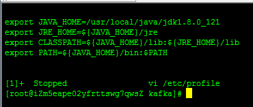
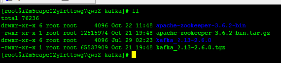
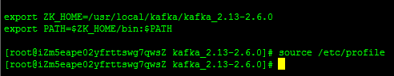
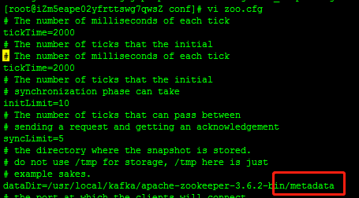
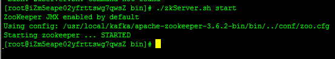
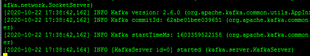

# 系统及软件环境
## 一、系统环境及运行版本
- OS版本：CentOS7+
- JDK：1.8+
- Kafka：kafka_2.13-2.6.0
- zookeeper：zookeeper-3.6.2
## 二、环境构建
### 1.JDK
- 下载jdk-8u121-linux-x64.tar.gz至服务器
- 解压
```
tar -xzvf jdk-8u121-linux-x64.tar.gz
```
- 配置环境变量
```
vi ~/.bash_profile
```
```
export PATH
export JAVA_HOME=/mnt/hgfs/share/jdk1.8.0_221
export JRE_HOME=${JAVA_HOME}/jre
export CLASSPATH=.:${JAVA_HOME}/lib:${JRE_HOME}/lib
export PATH=${JAVA_HOME}/bin:$PATH:.
```
```
source ~/.bash_profile
```


### 2.zookeeper
- 解压、设置环境变量（同上）   


- 创建文件目录、配置   

- 集群配置，增加多台服务器及通信端口、选举端口
```
server.0=192.168.137.88:2888:3888
server.1=192.168.137.89:2888:3888
server.2=192.168.137.90:2888:3888
```
- 启动zookeeper   
```
cd $ZK_HOME/bin
./zkServer.sh start
```


### 3.Kafka
- 直接解压，启动
quickstart过程单机通过控制台本机实验，暂不修改配置文件
```
bin/kafka-server-start.sh config/server.properties
```

- 集群部署配置调整   
broker.id修改为不重复的值
```
zookeeper.connect=192.168.137.88:2181,192.168.137.89:2181,192.168.137.90:2181
```

集群部署后启动失败，关闭防火墙、建立主机间授信
```
firewall-cmd state
systemctl stop firewalld.service
systemctl disable firewalld.service
```
授信可使用脚本工具：https://github.com/simahao/lily/tree/main/tools/centos7.sh中第15个选项处理