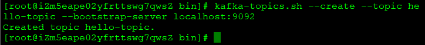
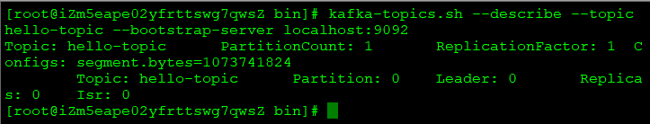
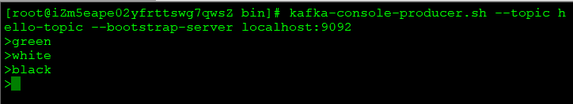
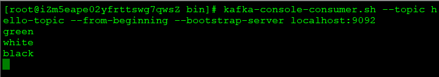
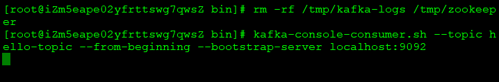

# 控制台基础操作
进入bin目录
## 1.创建topic
```
kafka-topics.sh --create --topic hello-topic --bootstrap-server localhost:9092
```

## 2.查看topic信息
```
kafka-topics.sh --describe --topic hello-topic --bootstrap-server localhost:9092
```

## 3.生产消息
```
kafka-console-producer.sh --topic hello-topic --bootstrap-server localhost:9092
```

## 4.消费消息
```
kafka-console-consumer.sh --topic hello-topic --from-beginning --bootstrap-server localhost:9092
```

## 5.终止环境
- producer、consumer终止：ctrl+C
- 清除数据：先停zookeeper、kafka后，执行如下（如修改目录配置，需要调整位置）
```
rm -rf /tmp/kafka-logs /tmp/zookeeper
```
清除后，消费者无任何数据   

