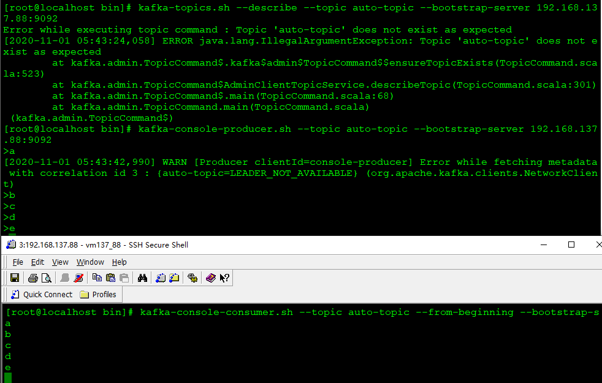

[toc]
## Broker Configs
### broker.id
重要，集群内不可重复的int值，未设置则生成一个不重复的id   


### log.dirs
必设参数，日志目录，kafka把所有的消息都存在磁盘中，此参数指定存储位置，默认tmp下   


### log.dir
同log.dirs，优先级低于log.dirs

### message.max.bytes
接收消息的最大值，默认1000012b，如果大于此参数大小，则报RecordTooLargeException

### zookeeper.connect
必设参数，kafka运行依赖zookeeper，多个zookeeper用逗号连接  
可增加chroot目录，如：
```
zookeeper.connect=127.0.0.1:3000,127.0.0.1:3001,127.0.0.1:3002/kafka
```
chroot路径可使同一zookeeper被多套Kafka应用，服用zookeeper资源，不指定默认使用zookeeper根路径。


### advertised.host.name
废弃，仅用于advertised.listeners，listeners未设置情况的替代参数

### advertised.listeners
重要，listeners是kafka真正bind的地址，advertised.listeners是暴露给外部的地址，未设置，默认采用listener配置

### advertised.port
废弃，仅用于advertised.listeners，listeners未设置情况的替代参数

### auto.create.topics.enable
重要，默认true，当生产者生产消息时，若topic不存在是否创建，默认为true   


### background.threads
重要，用于各种后台处理的线程数量，int，大于1

### compression.type
重要，压缩类型，支持标准的压缩方式如：'gzip', 'snappy', 'lz4', 'zstd'，可设置为不压缩：uncompressed。默认为producer为自带的原始压缩方式

### delete.topic.enable
重要，默认true，如不允许通过admin工具删除topic，将其设置为false

### host.name
重要，已作废，Broker主机IP地址或域名，当listeners未设置是用于替代之用

### auto.leader.rebalance.enable
重要，是否允许leader rebalance，默认true。若允许kafka controller开启一个后台进程   
在leader.imbalance.check.interval.seconds所设置的时间频度内，在分区不平衡率在leader.imbalance.per.broker.percentage所设置的比例以上时
进行leader重选举
分区不平衡率 = 非优先副本个数 / 分区总数
注：当某个分区的leader节点发生故障，将从follower节点中选举出新的leader节点，原有leader节点恢复工作后，并不会恢复leader节点身份，因此，当由于宕机或网络等原因导致leader节点聚集在某个broker时，会造成该节点负载过大，形成失衡

### leader.imbalance.check.interval.seconds
重要，当auto.leader.rebalance.enable开关打开，进行rebalance检查处理的时间频度参数，long，默认300（5分钟）

### leader.imbalance.per.broker.percentage
重要，当auto.leader.rebalance.enable开关打开，允许broker的分区不平衡率大最大比率，默认10（%），超过此比率进行基于优先副本机制的rebalance处理

### port
已作废，Broker端口

### listeners
重要，Broker监听，Broker间，Client与Broker间通信时，建立连接的入口地址，设置多个用逗号分隔。   
格式：protocol1://hostname1:port,protocol2://hostname2:port2   
protocol为协议类型，支持：PLAINTEXT、SSL、SASL_SSL等。如未启用安全认证，使用PLAINTEXT即可；   
hostname为主机名，不指定则绑定默认网卡，可能会指定到127.0.0.1，导致不能对外服务；如果主机名为0.0.0.0，表示绑定所有网卡。   
```
listeners=PLAINTEXT://192.168.137.88:9092
```

### listener.security.protocol.map
重要，以Key:Value的形式定义监听者的安全协议   
```
listener.security.protocol.map=PLAINTEXT:PLAINTEXT,SSL:SSL,SASL_PLAINTEXT:SASL_PLAINTEXT,SASL_SSL:SASL_SSL 
```

### inter.broker.listener.name
中等。broker之间内部通信使用的监听，其值设置为监听安全策略值即可，未设置则取security.inter.broker.protocol值，故二者不能同时配置

### security.inter.broker.protocol
中等。broker之间内部通信使用的安全策略，默认为PLAINTEXT，不与inter.broker.listener.name同时设置

### num.network.threads
重要，Broker在网络间接收\发送消息的线程数，int，默认3

### num.io.threads
重要，Broker在进行磁盘IO处理的线程数，int，默认8

### broker.rack
字符串，默认为null
- kafka支持在broker节点设置机架信息，指定机架后kafka在分区副本分配时，会尽量让副本不在同一机架的broker上，避免同一机架故障导致多副本失效
- 机架信息在kafka集群中要么全不设置，要么全都设置，仅设置部分broker的机架信息，则会报AdminOperationException
- 可以通过--disable-rack-aware来忽略broker.rack参数

### num.partitions
创建主题时，如不指定分区数量，默认创建的分区数，默认为1


### log.index.interval.bytes
由于kafka是稀疏索引，索引不会记录所有消息，通过此参数设置每定量消息产生一个索引项，默认4096，即4k

### log.segment.bytes
日志分段文件值大小，当超过此值，新建segment分段文件。默认1G

### log.index.size.max.bytes
索引文件的最大值，超过此值，则新建一个索引文件。默认10M
索引文件一创建，就会创建一个此大小的索引文件，直到切分出新的索引文件，kafka才对该索引文件裁剪为实际大小

### log.cleanup.policy
log.cleanup.policy=delete\compact决定删除还是压缩。默认delete

### log.retention.check.interval.ms
通过log.retention.check.interval.ms配置检测是否需删除日志的周期 时间，默认5分钟

### log.retention.hours \ log.retention.minutes \ log.retention.ms
根据上述参数配置的日志保留时间，与日志分段最大的时间戳largestTimestamp对比，判断是否超过策略设置的清除时间，如超过，则删除   
上述三个参数时间单位越小，优先级越高，log.retention.ms最高，log.retention.hours最低，默认log.retention.hours=168，即7天

### file.delete.delay.ms
删除日志延迟任务启动时间，默认1分钟

### broker.id.generation.enable & reserved.broker.max.id
两个参数配合使用，自动生成kafka的brokerId   
broker.id.generation.enable默认为false，即不自动生成，设置为true时，开启自动生成brokerId   
自动生成brokerId有一个基准值，自动生成的id必须大于此基准，reserved.broker.max.id即为基准值，默认1000，则0-1000留给手动设置，1000以上为自动设置   

