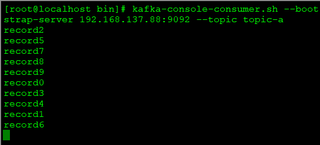
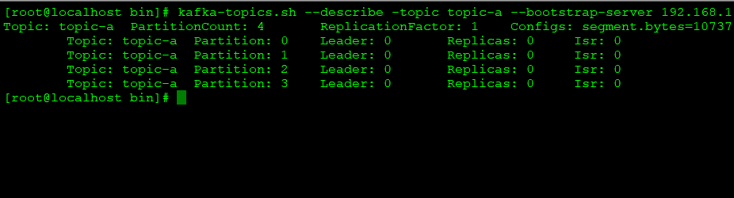
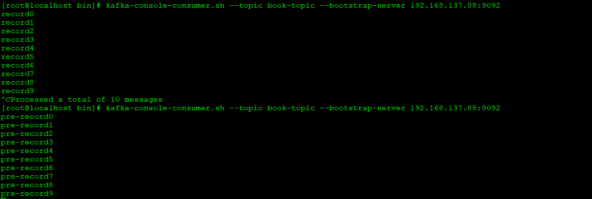

# Producer
## 一、客户端开发
### 1.代码示例
- Producer客户端配置信息
```
    public static Properties initConfig(String serializerKey, String serializerValue) {
        Properties properties = new Properties();
        properties.put(org.apache.kafka.clients.producer.ProducerConfig.BOOTSTRAP_SERVERS_CONFIG, Cons.host_port);
        properties.put(org.apache.kafka.clients.producer.ProducerConfig.ACKS_CONFIG, "all");
        properties.put(org.apache.kafka.clients.producer.ProducerConfig.RETRIES_CONFIG, "3");
        properties.put(org.apache.kafka.clients.producer.ProducerConfig.BATCH_SIZE_CONFIG, "16384");
        properties.put(org.apache.kafka.clients.producer.ProducerConfig.LINGER_MS_CONFIG, "1");
        properties.put(org.apache.kafka.clients.producer.ProducerConfig.BUFFER_MEMORY_CONFIG, "33554432");
        properties.put(org.apache.kafka.clients.producer.ProducerConfig.KEY_SERIALIZER_CLASS_CONFIG, serializerKey);
        properties.put(org.apache.kafka.clients.producer.ProducerConfig.VALUE_SERIALIZER_CLASS_CONFIG, serializerValue);
        return properties;
    }
```
参数说明：   
1. bootstrap.servers：指定生产者连接的broker，可设置一个或多个，设置单个即可连接集群，但建议设置多个，以避免单点宕机风险
2. key.serializer、value.serializer：传递消息的key和value序列化的类，kafka只接收字节数组byte[]，故需要序列化
3. client.id：客户端id，如设定亦可，Producer会自动生成
4. retries：对于可重试的异常，允许的重试次数，默认为0。异常如：网络异常、leader不可用等短时间可恢复的异常场景
5. Producer参数较多，可通过org.apache.kafka.clients.producer.ProducerConfig中的常量来避免书写错误。   
6. 序列化、反序列化的class全名也较易出错，可以将"org.apache.kafka.common.serialization.StringSerializer"替换为XxxClass.class.getName()

- 生产者发送消息——异步发送（async）
```
    /**
     * producer异步发送
     */
    public static void producerSend() {
        Properties properties = ProducerConfig.initConfig(Cons.STRING_SERIALIZER_KEY, Cons.STRING_SERIALIZER_VALUE);
        Producer<String, String> producer = new KafkaProducer<>(properties);
        // send10条记录
        for (int i = 0; i < 10; i++) {
            ProducerRecord<String, String> producerRecord = new ProducerRecord<>(Cons.TEST_TOPIC_NAME, "key" + i, "record" + i);
            producer.send(producerRecord);
        }
        producer.close();
    }
```
- 消费情况   
消费消息顺序不是0-9，原因是该topic中有4个partition，多partition无法保证顺序。   



- 生产者发送消息——异步回调发送
```
    /**
     * producer异步发送（优化）
     */
    public static void producerSendGrace() {
        Properties properties = ProducerConfig.initConfig(Cons.STRING_SERIALIZER_KEY, Cons.STRING_SERIALIZER_VALUE);
        Producer<String, String> producer = new KafkaProducer<>(properties);
        // send10条记录
        for (int i = 0; i < 10; i++) {
            ProducerRecord<String, String> producerRecord = new ProducerRecord<>(Cons.TEST_TOPIC_NAME_MUTI_PARTITION, "key" + i, "record" + i);
            producer.send(producerRecord, new Callback() {
                @Override
                public void onCompletion(RecordMetadata recordMetadata, Exception e) {
                    if (e != null) {
                        // 异常的处理逻辑
                    } else {
                        // 异步正常回调处理逻辑
                    }
                }
            });
        }
        producer.close();
    }
```
- 生产者发送消息——异步阻塞发送   
```
    /**
     * producer异步阻塞发送
     */
    public static void producerSyncSend() throws ExecutionException, InterruptedException {
        Properties properties = ProducerConfig.initConfig(Cons.STRING_SERIALIZER_KEY, Cons.STRING_SERIALIZER_VALUE);
        Producer<String, String> producer = new KafkaProducer<>(properties);
        // send10条记录
        for (int i = 0; i < 10; i++) {
            ProducerRecord<String, String> producerRecord = new ProducerRecord<>(Cons.TEST_TOPIC_NAME_ONE_PARTITION, "key" + i, "record" + i);
            Future<RecordMetadata> future = producer.send(producerRecord);
            long offset = future.get().offset();
            int partition = future.get().partition();
            LOGGER.info("============================producer异步阻塞发送： partition" + partition + " |offset：" + offset + "============================");
        }
        producer.close();
    }
```
代码说明：
1. KafkaProducer线程安全，可以在多线程中共享KafkaProducer实例
2. producer.send为异步方法，直接调用为异步；但对返回Future.get()，则为异步阻塞式发送
3. send(ProducerRecord, Callback)方法为异步+回调，回调中可记录异常或成功信息及相关处理，其中回调函数中的recordMetadata、exception是互斥的，非异常即正常；同时，回调函数亦能保证有序
3. Producer<String, String>泛型代表消息对象中的key、value类型
4. 异常：Producer中有两类异常：分为可重试异常、不可重试异常。可短暂恢复的为可重试，如NetworkException、LeaderNotAvailableException、UnkownTopicOrPartitionException等。可在Properties对象中设置重试次数，默认该次数为0

### 2.消息对象——ProducerRecord
对象包含多个属性：
```
public class ProducerRecord<K, V> {
    private final String topic;
    private final Integer partition;
    private final Headers headers;
    private final K key;
    private final V value;
    private final Long timestamp;
...
}
```
- topic：目标主题
- partition：目标分区
- headers：选用，用于设定业务相关信息
- key：消息的附加信息，可控制消息发往的分区，相同key消息会发往同一分区
- value：要发的消息，null的话代表墓碑消息
- timestamp：分为创建时间、追加时间

### 3.序列化
- 序列化器：生产者一端，将消息对象转化为字节数组
- 反序列化器：消费者一端，将字节数组恢复为消息对象
- 序列化器实现org.apache.kafka.common.serialization.Serializer接口，可以自定义序列化、反序列化类进行序列化处理
- 客户端提供部分基础数据类型的序列化处理类，若不能满足可引入protobuf、protostuff、json等序列化器

### 3.分区器
消息序列化后，需要发往topic的对应分区，若ProducerRecord中指定了分区，则发往指定分区，否则需要通过分区器选择分区。   
- 分区器实现org.apache.kafka.clients.producer.Partitioner接口，partition方法负责返回分区号，如自定义则重写该方法   
```
int partition(String var1, Object var2, byte[] var3, Object var4, byte[] var5, Cluster var6)
```
- 默认分区器通过key进行消息分区   
1. 当key为null，则消息在当前可用分区中进行轮询投递；
2. 当key非null，则对key进行hash处理，通过hash值在所有分区中选择分区号，key值相同的消息，在分区数未调整的前提下，一定分配至同一分区  
注：轮询方式只在可用分区中轮询，hash方式在所有分区中进行分配

### 4.拦截器
- 生产者、消费者均有各自的拦截器
- 配置拦截器，拦截器不限于单个拦截器，可以多个拦截器构成拦截链，拦截链中某个拦截器异常，不影响下一拦截器执行
```
    // 配置拦截器，如果配置多个拦截器，多个类名拼成一个字符串，类间用逗号分隔
    properties.put(org.apache.kafka.clients.producer.ProducerConfig.INTERCEPTOR_CLASSES_CONFIG, PrefixProducerInterceptor.class.getName());
```
- 作用：发送前做前期准备工作，如修改消息；发送前的统计数据收集
- 时机：拦截器->序列化->计算分区
- 拦截器接口：
```
public interface ProducerInterceptor<K, V> extends Configurable {
    // 发送前调用
    ProducerRecord<K, V> onSend(ProducerRecord<K, V> var1);
    // 应答前 或 返回异常前
    void onAcknowledgement(RecordMetadata var1, Exception var2);
    // 关闭前，回收资源
    void close();
}
- 异常的处理：拦截器的几个方法在发生异常时，不抛出异常（一种合理的不传递异常的情况）
```
- 使用：为消息体增加前缀   
```
public class PrefixProducerInterceptor implements ProducerInterceptor<String, String>{
    @Override
    public ProducerRecord onSend(ProducerRecord<String, String> producerRecord) {
        String prefixValue = "pre-" + producerRecord.value();
        return new ProducerRecord<String, String>(producerRecord.topic(), producerRecord.partition(), producerRecord.timestamp(), producerRecord.key(), prefixValue);
    }
    ...
}

```



## 二、Producer原理

Producer由两个主要线程构成：主线程、sender线程，前者组织消息，后者发送消息。   
### 1.主线程
- 处理流   
1. KafkaProducer完成配置信息收集、构建ProducerRecord对象发出
2. 拦截器对消息进行业务发出前的处理
3. 序列化器将消息转为字节数组
4. 分区器计算消息发往目标topic的partition
5. RecordAccumulator负责积累持续而来的消息，构成ProducerBatch，批量发送给Sender线程处理 
- 数据结构   
RecordAccumulator->包括n个Deque<ProducerBatch>->包含多个ProducerBatch->包含多条ProducerRecord   
ProducerRecord合并至ProducerBatch使字节（数据）更为紧凑，减少IO次数，提升吞吐量   
- 缓存机制   
消息在传输过程以字节数组存在，为了避免反复内存创建和释放，生产者内部有一个类似ByteBuffer缓存机制，当生产出的消息评估后，大小不超过batch.size设置参数值，该消息会生成ProducerBatch对象，且被复用，超过该大小，生成的ProducerBatch不会复用
- 相关参数   
1. buffer.memory RecordAccumulator存放消息的缓冲区大小，默认32M，如果目标分区较多，可调大参数，提升吞吐量
2. max.block.ms 最大阻塞时间，默认600000ms 当生产者消息发送速度快于服务器接收速度时，将产生阻塞，阻塞超过该参数时间，则抛出异常
3. batch.size ProducerBatch缓存大小，默认16KB。

### 2.Sender线程
- 处理流   
1. Sender发送前将数据保持至 InFlightRequests，结构为 Map<Node, Deque<Request>>，保存的目的为记录已发往broker节点，但未收到响应的消息
2. 如果Deque<Request>的size与max.in.flight.requests.per.connection值一致，证明目标节点消息处理堆积，则不能再向该连接发送消息
3. 当有响应消息，则清理连接中的消息，通知主线程RecordAccumulator清理
- 数据结构   
Sender线程从RecordAccumulator获取缓存消息后：   
<分区, Deque<ProducerBatch>> 转化为 <Node, List<ProducerBatch>>， Node为broker节点   
<Node, List<ProducerBatch>>  转化为 <Node, Request>，Request为ProducerRequest类   
- 相关参数   
1. max.in.flight.requests.per.connection InFlightRequests中每个连接最多缓存多少个未响应的请求，默认值5

## 三、元数据同步
- 集群元数据作用   
让生产者知晓目标topic分区情况，包括分区的replica情况，分区leader所在的broker情况，replica情况等等，知晓以上情况，分区器方可进行消息分区的计算及发送
- 更新元数据时机   
1. 需要使用元数据时，客户端不存在所需的元数据，则会主动进行更新
2. 超过metadata.max.age.ms参数设定的时间，则定时进行同步更新
- 相关参数    
1. metadata.max.age.ms 元数据同步的时间间隔

## 四、其他重要参数
1. acks
指定分区中必须要有多少个副本收到消息，生产者才认为消息是发送成功的   
- 1 默认值，只要分区的leader副本收到消息，服务端就产生成功响应，此设置为可靠性与吞吐量的折中   
- 0 发出后，不待响应，最大吞吐量方案，无法保证可靠性
- -1 或 all, 所有ISR中的副本都收到消息，服务端才生成成功响应，为最强可靠性，但如果只有一个leader副本，则与设置为1无差异，可以结合min.insync.replicas参数确保最小的副本数


