# Consumer
## 一、客户端开发
### 1.代码示例
- Producer客户端配置信息
```
    public static Properties initConfig(String deserializerKey, String deserializerValue) {
        Properties properties = new Properties();
        properties.setProperty(org.apache.kafka.clients.consumer.ConsumerConfig.BOOTSTRAP_SERVERS_CONFIG, HOST_PORT);
        properties.setProperty(org.apache.kafka.clients.consumer.ConsumerConfig.GROUP_ID_CONFIG, "test_consumer_group_id");
        properties.setProperty(org.apache.kafka.clients.consumer.ConsumerConfig.CLIENT_ID_CONFIG, "test_consumer_client_id");
        properties.setProperty(org.apache.kafka.clients.consumer.ConsumerConfig.AUTO_COMMIT_INTERVAL_MS_CONFIG, "1000");
        properties.setProperty(org.apache.kafka.clients.consumer.ConsumerConfig.ENABLE_AUTO_COMMIT_CONFIG, "true");
        properties.put(org.apache.kafka.clients.consumer.ConsumerConfig.KEY_DESERIALIZER_CLASS_CONFIG, deserializerKey);
        properties.put(org.apache.kafka.clients.consumer.ConsumerConfig.VALUE_DESERIALIZER_CLASS_CONFIG, deserializerValue);
        return properties;
    }
```
参数说明：   
1. bootstrap.servers：指定生产者连接的broker，可设置一个或多个，设置单个即可连接集群，但建议设置多个，以避免单点宕机风险
2. key.deserializer、value.deserializer：传递消息的key和value反序列化的类，需与producer中的序列化类对应
3. client.id：客户端id，如设定亦可，cosumer会自动生成，如consumer-1
4. group.id：consumer隶属消息组名称，默认""，设置为null会抛异常

- 消费者消费消息——所有分区
```
    public static void consumerAutoCommit() {
        // 定义配置信息
        Properties properties = CsmConfig.initConfig(StringDeserializer.class.getName(), StringDeserializer.class.getName());
        KafkaConsumer<String, String> kafkaConsumer = new KafkaConsumer<>(properties);
        // 订阅主题，可多个
        kafkaConsumer.subscribe(Arrays.asList(TEST_TOPIC_NAME_MUTI_PARTITION));
        while (true) {
            ConsumerRecords<String, String> pollRecords = kafkaConsumer.poll(Duration.ofMillis(10000));
            for (ConsumerRecord<String, String> pollRecord : pollRecords) {
                LOGGER.info("---------- partition" + pollRecord.partition() + ",offset " + pollRecord.offset() + ",key " + pollRecord.key() + ",value " + pollRecord.value());
            }
        }
    }
```
代码消费了topic的所有分区的消息   
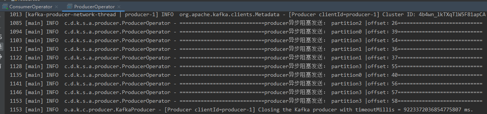
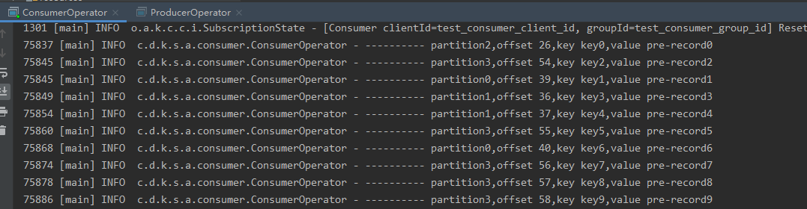   
代码说明：   
1. kafkaConsumer.subscribe()消息订阅可以订阅多个topic，采用直接罗列或正则表达式
2. 多次执行subscribe()，仅最后一次生效，而非对多个主题生效
3. poll方法的参数为阻塞时间，方法在超出该时间或者获取了足够的消息数量后，返回客户端代码处理
4. Duration为java8版本提供的一个表达时间的对象，可以提供如毫秒、秒、分钟、天等不同单位的时间表达

- 消费者消费消息——指定分区
```
    public static void consumerAssignPartition() {
        TopicPartition topicPartition1 = new TopicPartition(TEST_TOPIC_NAME_MUTI_PARTITION, 0);
        TopicPartition topicPartition2 = new TopicPartition(TEST_TOPIC_NAME_MUTI_PARTITION, 1);
        List<TopicPartition> topicPartitionArrayList = Lists.newArrayList(topicPartition1, topicPartition2);
        // 定义配置信息
        Properties properties = CsmConfig.initConfig(StringDeserializer.class.getName(), StringDeserializer.class.getName());
        KafkaConsumer<String, String> kafkaConsumer = new KafkaConsumer<>(properties);
        // 订阅主题，可多个
        kafkaConsumer.assign(topicPartitionArrayList);
        while (true) {
            ConsumerRecords<String, String> pollRecords = kafkaConsumer.poll(Duration.ofMillis(10000));
            for (ConsumerRecord<String, String> pollRecord : pollRecords) {
                LOGGER.info("---------- partition" + pollRecord.partition() + ",offset " + pollRecord.offset() + ",key " + pollRecord.key() + ",value " + pollRecord.value());
            }
        }
    }
```
代码消费了topic的指定分区的消息   
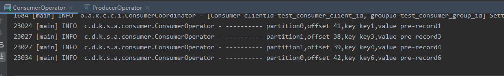
代码说明：
1. TopicPartition类用来创建Topic + Partition的实例，该类只有两个属性，用于指定topic下的分区
2. kafkaConsumer.assign()方法不仅指定主题，还指定分区

- 在指定主题中按分区处理消息
```
    public static void consumerBypartition() {
        Properties properties = CsmConfig.initConfig(StringDeserializer.class.getName(), StringDeserializer.class.getName());
        KafkaConsumer<String, String> kafkaConsumer = new KafkaConsumer<>(properties);
        kafkaConsumer.subscribe(Arrays.asList(TEST_TOPIC_NAME_MUTI_PARTITION));
        while (true) {
            ConsumerRecords<String, String> pollRecords = kafkaConsumer.poll(Duration.ofMillis(10000));
            Set<TopicPartition> partitions = pollRecords.partitions();
            for (TopicPartition partition : partitions) {
                List<ConsumerRecord<String, String>> partitionRecords = pollRecords.records(partition);
                for (ConsumerRecord<String, String> pollRecord : partitionRecords) {
                    LOGGER.info("---------- partition" + pollRecord.partition() + ",offset " + pollRecord.offset() + ",key " + pollRecord.key() + ",value " + pollRecord.value());
                }
            }
        }
    }
```
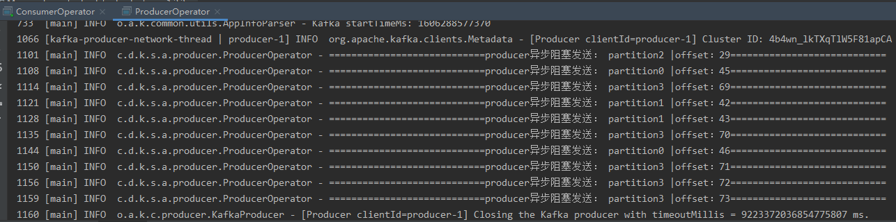
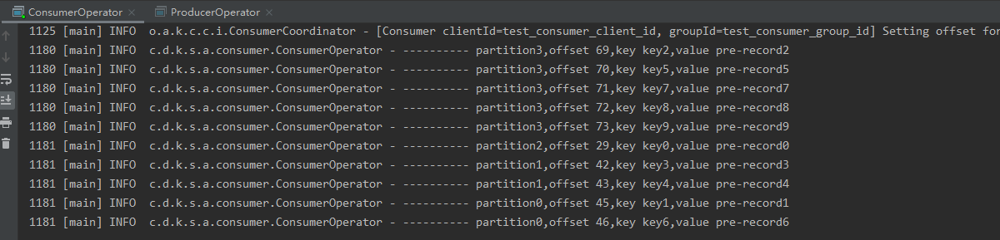
在有必要的情况下可以使用多线程来消费不同partition的消息

- Consumer获取主题中的分区信息
```
    public static void getPartitionInfo() {
        Properties properties = CsmConfig.initConfig(StringDeserializer.class.getName(), StringDeserializer.class.getName());
        KafkaConsumer<String, String> kafkaConsumer = new KafkaConsumer<>(properties);
        List<PartitionInfo> partitionInfoList = kafkaConsumer.partitionsFor(TEST_TOPIC_NAME_MUTI_PARTITION);
        for (PartitionInfo partitionInfo : partitionInfoList) {
            TopicPartition topicPartition = new TopicPartition(partitionInfo.topic(), partitionInfo.partition());
            LOGGER.info(topicPartition.toString());
        }
    }
```
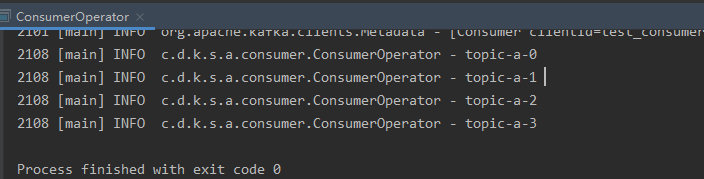   
除主题分区信息外，PartitionInfo以下副本信息可以进行精细化的处理   
```
    // leader副本所在节点
    private final Node leader;
    // AR
    private final Node[] replicas;
    // ISR
    private final Node[] inSyncReplicas;
    // OSR
    private final Node[] offlineReplicas;
```
- 消费者退订消息
```
    public static void consumerUnsubscribe() {
        // 定义配置信息
        Properties properties = CsmConfig.initConfig(StringDeserializer.class.getName(), StringDeserializer.class.getName());
        KafkaConsumer<String, String> kafkaConsumer = new KafkaConsumer<>(properties);
        // 订阅主题，可多个
        kafkaConsumer.subscribe(Arrays.asList(TEST_TOPIC_NAME_MUTI_PARTITION));
        // 下面三种方式均达到取消订阅效果
        kafkaConsumer.unsubscribe();
        kafkaConsumer.subscribe(new ArrayList<>());
        kafkaConsumer.assign(new ArrayList<>());
        kafkaConsumer.poll(Duration.ofMillis(10000));
    }
```
unsubscribe和订阅一个空的效果等同，在未做任何订阅的情况下，拉去消息，会产生如下异常   
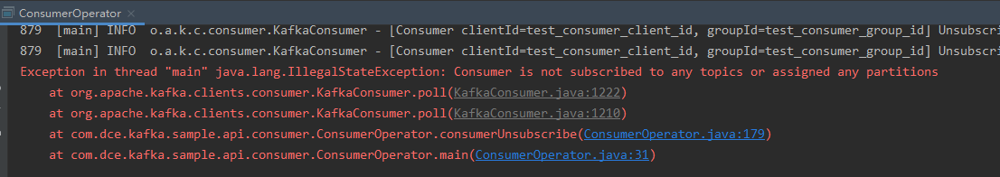

### 2.subscribe & assign
- subscribe方法订阅的主题，多个消费者的情况下，具备rebalance功能，根据消费者数量动态调整消费者与分区关系
- assign 指定主题分区的不具备自动均衡处理（assgin方法无ConsumerRebalanceListener类）

### 3.反序列化
- 反序列化类与序列化类相互对应
- 可以自定义序列化、反序列化，但建议不采用自定义，增加生产者、消费者间的耦合性

### 4.消息消费
1. 常规获取消息方式包括：推送，服务端将消息推送至客户端；拉取，客户端发起请求从服务端获取；
2. kafka采用拉方式消费消息（poll）
3. poll(Duraion)方法中的阻塞时间参数的设置，考虑响应速率的要求来设置，需要注意该时间包括了rebalance、获取消息等行为的耗时   
设置为0不论是否拿到消息，都会立刻返回   
设置为一天，程序也不会真阻塞一天，当拿到fetch.max.bytes参数设置的最大消息数后，也会返回      
4. 消费记录对象ConsumerRecord
poll拉取返回为ConsumerRecords，其中包含多个ConsumerRecord，主要属性如下
```
public class ConsumerRecord<K, V> {
    // 主题、分区、偏移量
    private final String topic;
    private final int partition;
    private final long offset;
    // 时间戳及类型，包括：创建消息时间、追加到日志时间
    private final long timestamp;
    private final TimestampType timestampType;
    // key大小，如果key为null则size为-1
    private final int serializedKeySize;
    // 同keySize
    private final int serializedValueSize;
    // producer端生成的header
    private final Headers headers;
    // producer指定的key
    private final K key;
    // 消息对象
    private final V value;
    ...
}
```
### 5.offset
- kafka分区中通过offset作为分区消息的“偏移量”
- 在consumer端offset作为消费者消费的“位移”
- 消费位移以持久化方式存储于kafka内部主题__consumer_offsets中，并持久化，避免丢失
- 消费者消费完成后，需提交消费位移。注：消费者提交的offset，为下一次拉取的起点，而非本次消费的截止点
- offset处理不当可能导致重复消费，即消费一半，未提交同步，程序宕掉，重新拉起，刚刚消费掉的消息重复消费；消息丢失，即未消费的消息已经提交同步，但宕掉，重新拉起，遗失了宕前未消费部分
- 提交模式：自动（系统默认）、手动（enable.auto.commit设置为false）

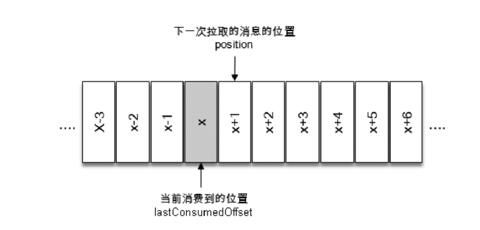

### 6.consumer手动提交
```
    public static void consumerNotAutoCommit() {
        Properties properties = CsmConfig.initConfig(StringDeserializer.class.getName(), StringDeserializer.class.getName());
        properties.setProperty(ConsumerConfig.ENABLE_AUTO_COMMIT_CONFIG, "false");
        KafkaConsumer<String, String> kafkaConsumer = new KafkaConsumer<>(properties);
        kafkaConsumer.subscribe(Arrays.asList(TEST_TOPIC_NAME_MUTI_PARTITION));
        while (true) {
            ConsumerRecords<String, String> pollRecords = kafkaConsumer.poll(Duration.ofMillis(10000));
            for (ConsumerRecord<String, String> pollRecord : pollRecords) {
                LOGGER.info("---------- partition" + pollRecord.partition() + ",offset " + pollRecord.offset() + ",key " + pollRecord.key() + ",value " + pollRecord.value());
            }
            // 可处理为业务处理成功提交，否则不提交，确保下次仍能获得该消息。commitAsync异步提交，commitSync同步
            kafkaConsumer.commitAsync(); // 异步方式
            // kafkaConsumer.commitSync();  // 同步方式
        }
    }
```
- 手动提交又分为两种处理方式：同步方式、异步方式
- 同步方式：kafkaConsumer.commitSync()，提交时阻塞消费者业务处理，等待过程会耗费一定性能   
另有重载方法，可提供细化到分区、偏移量的同步处理   
```
    public void commitSync(Map<TopicPartition, OffsetAndMetadata> offsets) {
        this.commitSync(offsets, Duration.ofMillis((long)this.defaultApiTimeoutMs));
    }
```
注：同步方法在执行前，业务代码出现异常，将导致偏移量未提交，重新运行产生重复消费问题
- 异步方式：kafkaConsumer.commitAsync()，提交的同时可能同步拉取消息，性能有一定增强
另有重载方法，可提供异步的回调处理、偏移量的处理   
```
    public void commitAsync(OffsetCommitCallback callback) 
    public void commitAsync(Map<TopicPartition, OffsetAndMetadata> offsets, OffsetCommitCallback callback)
```
注：异步方法在某次执行出错后，可采用重试机制，重试程序可能将后续提交的偏移量改小，导致重复消费   
如：第1次提交10，失败，准备2秒后重试，1秒后又有第2次提交了20的操作，2秒后第一次重试成功，又将20覆盖为10，后续再拉取，将产生重复消费   
解决方法：在重试时，比较要重复提交的偏移量与最近的偏移量，如果已经小于最近偏移量，则不用再重试，说明后续的同步流程已经更新偏移量为较大值。或者，不建立重试机制，依赖后续的同步完成出错的同步
- 在正常的退出或者rebalance前，需要在finally块完成同步动作

### 7.控制消费——暂停、恢复、跳出
可以在某种条件下，自行控制对某主题、分区的消费。   
- 暂停消费
```
    private static final AtomicBoolean isRunning = new AtomicBoolean(true);
    .....
    public static void consumerPause() {
        Properties properties = CsmConfig.initConfig(StringDeserializer.class.getName(), StringDeserializer.class.getName());
        KafkaConsumer<String, String> kafkaConsumer = new KafkaConsumer<>(properties);
        kafkaConsumer.subscribe(Arrays.asList(TEST_TOPIC_NAME_MUTI_PARTITION));
        while (isRunning.get()) {
            ConsumerRecords<String, String> records = kafkaConsumer.poll(Duration.ofMillis(1000));
            for (ConsumerRecord<String, String> pollRecord : records) {
                LOGGER.info("consumer partition" + pollRecord.partition() + ",offset " + pollRecord.offset() + ",key " + pollRecord.key() + ",value " + pollRecord.value());
               // 消费1条之后就暂停消费
                kafkaConsumer.pause(Sets.newHashSet(new TopicPartition(pollRecord.topic(), pollRecord.partition())));
            }
            LOGGER.info("当前暂停消费分区数：" + kafkaConsumer.paused().size());
        }
    }
```
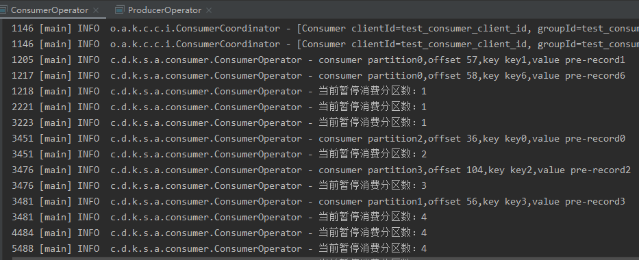
如上，分区0、2、3、1陆续被暂停消费，暂停后的分区就不再有消费产生。  
注：pause()方法需要在首次poll到partition后才能对该partition进行暂停，否则报 No current assignment for partition
- 恢复消费
``` java
    // 暂停消费
    kafkaConsumer.pause(Sets.newHashSet(new TopicPartition(pollRecord.topic(), pollRecord.partition())));
    // 恢复
    kafkaConsumer.resume(Sets.newHashSet(new TopicPartition(pollRecord.topic(), pollRecord.partition())));
```
resume() 方法将暂停的分区恢复消费
- 退出消费while   
方式一：通过isRunning.get()方式
```
    private static final AtomicBoolean isRunning = new AtomicBoolean(true);
    public static void consumerBreakWhile() {
        // 测试用，超过10次拉取空集合，则退出循环终止消费
        int emptyTimes = 10;
        Properties properties = CsmConfig.initConfig(StringDeserializer.class.getName(), StringDeserializer.class.getName());
        KafkaConsumer<String, String> kafkaConsumer = new KafkaConsumer<>(properties);
        kafkaConsumer.subscribe(Arrays.asList(TEST_TOPIC_NAME_MUTI_PARTITION));
        while (isRunning.get()) {
            ConsumerRecords<String, String> records = kafkaConsumer.poll(Duration.ofMillis(1000));
            // 超过固定次数空集合，不再循环
            if (records.isEmpty()) {
                if ((--emptyTimes) == 0)
                    isRunning.set(false);
            }
            LOGGER.info("count down:" + emptyTimes);
        }
    }
```
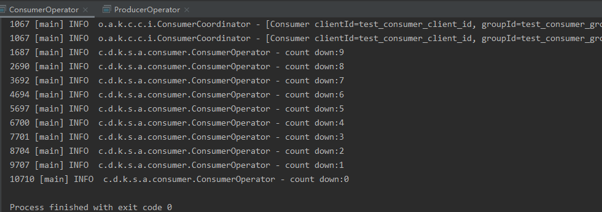
无生产者产生消息的情况下，10次空poll，通过isRunning.set(false)退出大循环   
方式二：通过wakeup
```
    public static void consumerBreakWhile() {
        // 测试用，超过10次拉取空集合，则退出循环终止消费
        int emptyTimes = 10;
        Properties properties = CsmConfig.initConfig(StringDeserializer.class.getName(), StringDeserializer.class.getName());
        KafkaConsumer<String, String> kafkaConsumer = new KafkaConsumer<>(properties);
        kafkaConsumer.subscribe(Arrays.asList(TEST_TOPIC_NAME_MUTI_PARTITION));
        while (isRunning.get()) {
            ConsumerRecords<String, String> records = kafkaConsumer.poll(Duration.ofMillis(1000));
            // 假设场景：取到超过次数的空集合，不再循环拉取
            if (records.isEmpty()) {
                if ((--emptyTimes) == 0)
                    // isRunning.set(false);
                    kafkaConsumer.wakeup();
            }
            LOGGER.info("count down:" + emptyTimes);
        }
    }
```
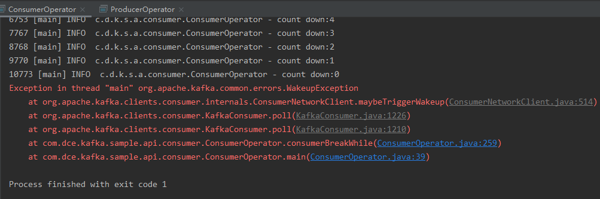
注：wakeup()可以从其他线程安全调用；wakeup后将产生WakeupException，需要catch，但不用对该异常处理

### 8.指定消费偏移量（ offset ）
#### 8.1 默认的offset获取
存在几种情况，消费组无法获取offset信息
- 新建消费组时，从未进行过消费，故无offset
- 为消费组新分配主题时，从未进行消费，无offset
- 消费组存在内部主题__consumer_offsets中的offset信息已超期，被清除后，无法获取offset
- 消费者在seek指定的offset超过当前latest，则越界，无法获取offset

获取不到offset时，consumer将读取auto.offset.reset参数，来指导自己offset的取值，auto.offset.reset取值
- latest（默认） ：从所分配分区的最末尾开始消费
- earliest ：从所分配分区的起始位置开始消费，起始位置为当前kafka中尚存在消息的低水位位置
- none ：配置为none，则不取起始，不取末尾，抛出异常：NoOffsetForPartitionException
- 为设置上述之一，则抛出ConfigException
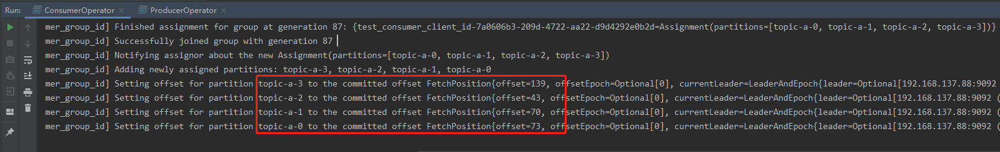
当采用默认情况下，consumer新创建后，先获取到分配的分区，并将offset初始指定到分区的最末尾
#### 8.2 seek指定offset
auto.offset.reset仅作用在无法获取offset情况，业务上需要灵活指定offset的场景需要使用seek()方法
```
    public static void consumerSeek() {
        Properties properties = CsmConfig.initConfig(StringDeserializer.class.getName(), StringDeserializer.class.getName());
        KafkaConsumer<String, String> kafkaConsumer = new KafkaConsumer<>(properties);
        kafkaConsumer.subscribe(Arrays.asList(TEST_TOPIC_NAME_MUTI_PARTITION));
        Set<TopicPartition> topicPartitionSet = Sets.newHashSet();
        // 需要先确保拉取到主题，才能进行seek，否则抛出No current assignment 异常
        while (topicPartitionSet.isEmpty()) {
            kafkaConsumer.poll(Duration.ofMillis(1000));
            topicPartitionSet = kafkaConsumer.assignment();
        }
        for (TopicPartition topicPartition : topicPartitionSet) {
            kafkaConsumer.seek(topicPartition, 0);
        }
        while (isRunning.get()) {
        ConsumerRecords<String, String> pollRecords = kafkaConsumer.poll(Duration.ofMillis(1000));
            for (ConsumerRecord<String, String> pollRecord : pollRecords) {
                LOGGER.info("---------- partition" + pollRecord.partition() + ",offset " + pollRecord.offset() + ",key " + pollRecord.key() + ",value " + pollRecord.value());
            }
        }
    }
```
执行结果如下   
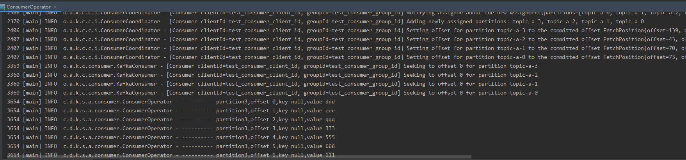   
可以看到消费者客户端启动后，各partition的offset均指在最末端，紧接着seek将offset指向0位置，然后消费从0开始   
seek方法用途较广，可用于kafka消息批量处理的原子性操作，如从offset=3000开始拉取100条数据，处理到51条后异常，则下次可以重新从3000拉取，避免重复消费   
### 9.Rebalance（再平衡）
#### 9.1概念   
- 消费组中的不同消费者承担不同分区的消费任务，当消费者的任务进行调整时需要进行再平衡处理，再平衡为消费组的高可用和伸缩性提供保障；   
- 再平衡期间，消费组内的消费者停止工作，不再读取消息；   
- 分区被更换消费者后，在原消费组的状态会丢失，可能导致重复消费；
- 应避免计划外、不必要的再平衡发生。
#### 9.2ConsumerRebalanceListener（再均衡监听器）
Consumer的subscribe方法支持传入再平衡监听   
```
    // 无再平衡监听的订阅
    public void subscribe(Collection<String> topics) {
        this.subscribe((Collection)topics, new NoOpConsumerRebalanceListener());
    }
    // 有再平衡监听的订阅
    public void subscribe(Pattern pattern, ConsumerRebalanceListener listener) {
        ...
    }
```
ConsumerRebalanceListener接口包括
```
    // 消费者停止读取消息后，进行再平衡前执行
    void onPartitionsRevoked(Collection<TopicPartition> var1);
    // 消费者重新分配分区后，重新获取消息前执行
    void onPartitionsAssigned(Collection<TopicPartition> var1);
```
- 可以在再平衡前，通过onPartitionsRevoked，进行offset的同步提交（commitSync），避免消息重复消费
- 也可通过onPartitionsRevoked，将分区的offset持久化到db中，再次消费前通过onPartitionsAssigned获取分区的offset继续消费

### 10.ConsumerInterceptor（消费者拦截器）
- 消费者拦截器在消费到消息（poll方法返回之前）或者提交offset之后时触发拦截器，进行业务所需的操作；
- 对应提供的接口为ConsumerInterceptor
- 配置项：interceptor.classes
- 拦截器异常不向上传递
- 多个拦截器可建立拦截链
```
    // poll方法返回之前
    ConsumerRecords<K, V> onConsume(ConsumerRecords<K, V> var1);
    // 提交offset之后
    void onCommit(Map<TopicPartition, OffsetAndMetadata> var1);
```