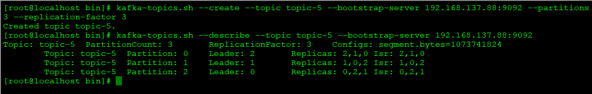
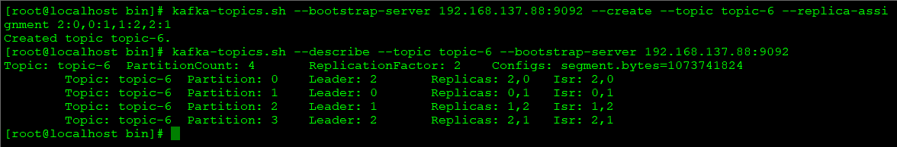
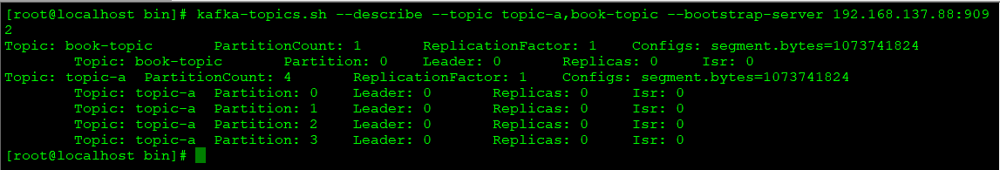
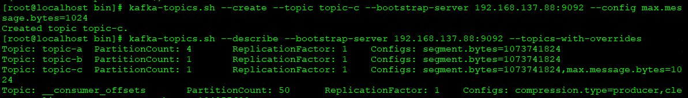
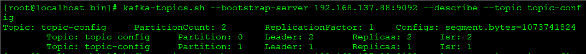
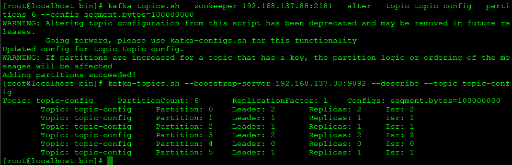
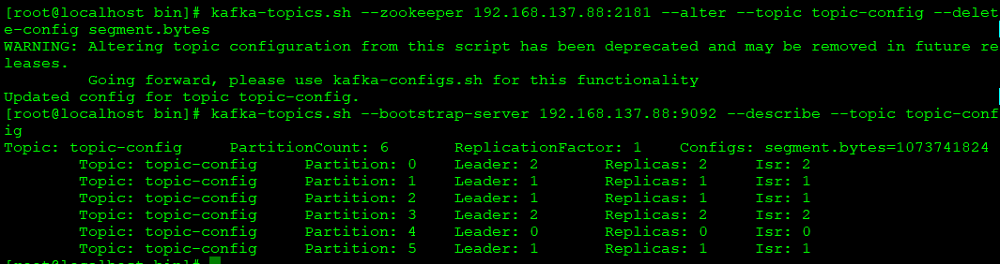
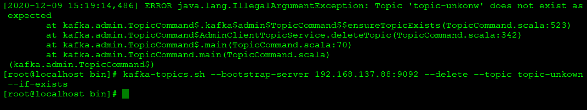
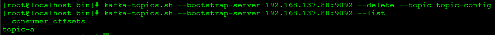

# Topic
- 分区为kafka提供可伸缩性、水平扩展
- 副本机制为kafka提供高可靠性
- 主题有多个分区，分区有多个副本，副本对应副本日志文件，日志文件对应多个日志分段，日志分段细分为索引文件、存储文件、快照文件
## 主题管理
### 一、主题创建
1.broker参数：auto.create.topics.enable默认为true，当true时：
- 生产者生产一条消息，对应的主题若不存在，则自动创建
- 消费者拉取一条消息，对应的主题若不存在，则自动创建
- 默认创建的分区数量为num.partitions数量（默认1）
- 从易于运维角度考虑，尽量避免自动创建，如自动创建可能因为手误，创建不想创建的主题  
 
2.主题创建可使用kafka-topics.sh创建
```
kafka-topics.sh  --bootstrap-server 192.168.137.88:9092 --create --topic topic-name  --partitions 4 --replication-factor 2
```
- --partitions ：分区数量
- --topic-name ：分区名称
- --replication-factor ：副本因子
- --create ：命令行为为创建，另有describe\list\delete\alter等行为   
- 命令执行见——[Commands](https://github.com/mihumouse/Kafka-Notes/blob/main/notes/99Commands.md)

3.主题创建后产生的日志文件可以在log.dir（或log.dirs）配置的的目录中查看
- 创建日志文件数量为：分区数 * 副本因子，如上例为 4 * 2 = 8 个分区文件
- 每个副本对应一个日志文件
- 副本默认平均分布在各个broker中，如上例命令，若broker为3个，则8个文件将以2:3:3的数量比例分布在不同broker中，如下：     
 
4.可通过命令参数--replica-assignment指定不同分区的分配方案   
```
kafka-topics.sh --bootstrap-server 192.168.137.88:9092 --create --topic topic-name --replica-assignment 2:0,0:1,1:2,2:1
```

使用--replica-assignment指定分区分配方案，就不必再使用--partitions 4 --replication-factor 2，因为“2:0,0:1,1:2,2:1”中已明确分区个数、副本分布情况

- 不同分区用“,”间隔，如上为4个分区指定分配情况
- 每个分区为副本分配的broker用“:”间隔
- 一个分区的副本不允许重复分配给相同broker，如：0:0,1:1,2:2,1:1，将报AdminCommandFailException异常
- 分区之间不允许指定的不同数量的副本，如：2:0,0,2,1，将报AdminOperatorException异常
- 跳过某个分区亦不被允许，如2:0,,,2:1，将报NumberFormatException异常

5.创建某个主题时若需要覆盖某些默认参数，则可通过--config参数来进行参数重写
```
kafka-topics.sh --bootstrap-server 192.168.137.88:9092 --create --topic topic-name  --partitions 4 --replication-facotr 2
--config max.message.bytes=20000
```
如上命令中的config将覆盖主题参数的max.message.bytes设置，将主题内最大消息大小设置为20000   
通过config命令自定义的参数，通过--describe可以回查

6.主题的命名
- 重复的命名，报TopicExistsException，在命令中增加--if-not-exists，则不报错，且不覆盖主题
- 命名中避免包括“.”，因为kafka后台处理过程会将“.”转化为“_”，这样topic.name和topic_name就会冲突，报InvalidTopicException
- 由于kafka内部主题以“__”开头，所以自定义主题最好避免以双下划线开头，避免误解

7.机架信息设置
- kafka支持通过broker.rack参数在broker节点设置机架信息，指定机架后kafka在分区副本分配时，会尽量让副本不在同一机架的broker上，避免同一机架故障导致多副本失效
- 机架信息在kafka集群中要么全不设置，要么全都设置，仅设置部分broker的机架信息，则会报AdminOperationException
- 可以通过--disable-rack-aware来忽略broker.rack参数

### 二、查看主题
1.查看所有主题--list
```
kafka-topics.sh --list --bootstrap-server 192.168.137.88:9092
```


其中__开头的为kafka内置的主题

2.查看指定主题--describe
```
kafka-topics.sh --describe --topic topic-a,book-topic --bootstrap-server 192.168.137.88:9092
```


3.查看覆盖配置的主题--topic-with-overrides
如使用--config，覆盖了topic的默认配置，可通过--describe + --topic-with-overrides获取，返回内容只是--list的首行
```
kafka-topics.sh --describe --bootstrap-server 192.168.137.88:9092 --topics-with-overrides
```


4.查询有失效分区副本的主题 --under-replicated-partitions 
```
kafka-topics.sh --describe --zookeeper 192.168.137.88:2181 --under-replicated-partitions 
```
   
- 在3个节点的kafka集群创建了分区3、副本因子3的主题，然后--describe分区、副本分布正常
- 停掉一个broker再查ISR中少了节点为0的副本信息，再使用--under-replicated-partitions查看，可以查到对应主题分区信息
- 重启之前停掉的节点，再运行--under-replicated-partitions ，则不再有相关信息
- 失效副本分区可能正在进行同步，或同步发生异常
- 通过命令监控系统中的分区是否有同步效率低或失效的情况

5.查询主题中没有leader的分区 --unavailable-partitions
```
 kafka-topics.sh --describe --zookeeper 192.168.137.88:2181 --unavailable-partitions 
```

### 三、修改主题
- 通过kafka-topics.sh + --alter修改主题既有主题配置
- 对分区数量的修改，只允许增加，不允许减少。因为减少后删除分区的消息不能合理的处理
```
kafka-topics.sh --bootstrap-server 192.168.137.88:9092 --alter --topic topic-config --partitions 4 
```



增加分区数量：      
   
- 当对分区数量修改时，如果原消息包含key值，则调整分区数量后原消息归属的分区逻辑将改变
- 修改主题配置时，需要结合--config对配置信息进行修改
```
kafka-topics.sh --zookeeper 192.168.137.88:2181 --alter --topic topic-config --partitions 6 --config segment.bytes=100000000
```
   
- 删除主题配置，恢复默认配置时，需要结合--delete-config进行
```
kafka-topics.sh --zookeeper 192.168.137.88:2181 --alter --topic topic-config --delete-config segment.bytes
```
   
- 通过kafka-topics.sh已经标识为deprecated，官方更推荐使用kafka-configs.sh脚本进行处理

### 四、配置管理
kafka-config.sh专门进行配置操作的脚本，结合--alter，可新增、修改、删除不同对象的配置
- entity-type : 指定修改目标的类型，包括：topics \ brokers \ clients \ users
- entity-name : 指定修改目标的名称，对应值为topic名称、brokerId、client.id、用户名
- --add-config：增加、修改配置；--delete-config：删除配置
```
kafka-configs.sh --bootstrap-server 192.168.137.88:9092 --alter --entity-type topics --entity-name topic-config --add-config max.message.bytes=9999
```
- --describe查看相关配置信息
```
kafka-configs.sh --bootstrap-server 192.168.137.88:9092 --describe --entity-type topics --entity-name topic-config
```
   
- 通过kafka-configs.sh修改配置时，zookeeper会创建对应的节点存储修改的配置信息，待到查看时，就从该节点获取信息
   

### 五、删除主题
- kafka内部自带主题不可删除
- 不存在的主题不可删除，删除时报IllegalArgumentException，通过 --if-exists来忽略此异常
- 主题删除的本质是zookeeper中/admin/delete_topics/下创建了一个待删除节点，由kafka控制器读取节点最终完成主题删除；故也可以手工增加zookeeper节点来删除主题
```
kafka-topics.sh --bootstrap-server 192.168.137.88:9092 --delete --topic topic-unkown --if-exists
```
   
- 主题删除的前提是delete.topic.enable=true，主题删除后不可逆
```
kafka-topics.sh --bootstrap-server 192.168.137.88:9092 --delete --topic topic-config
```
   
