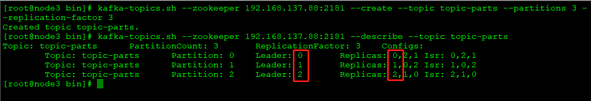
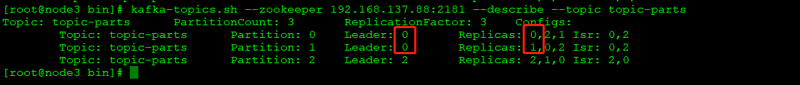
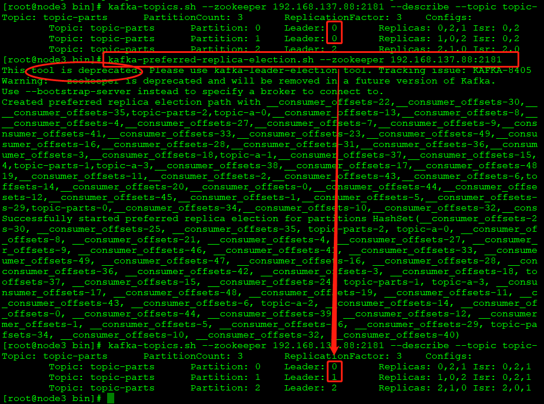
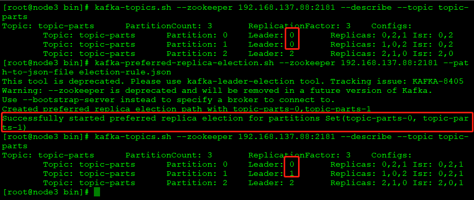
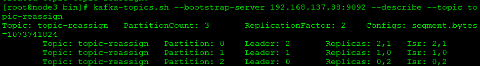
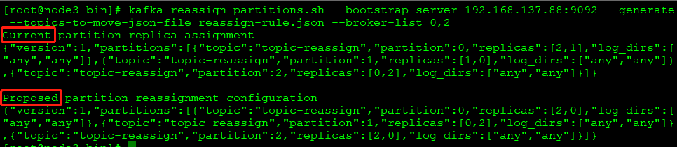
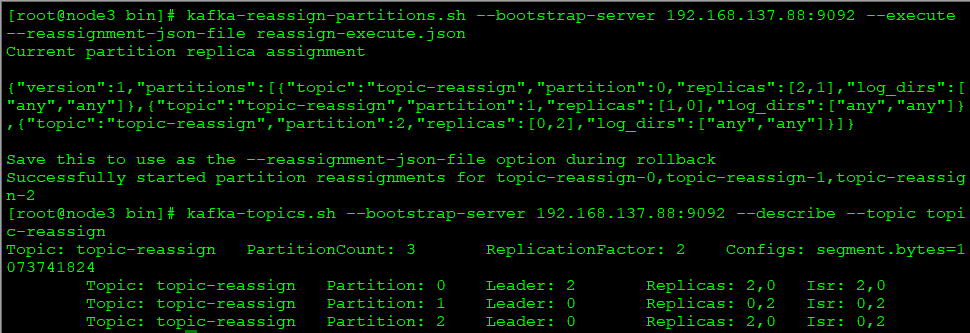
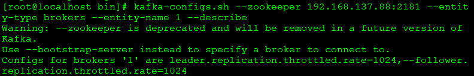
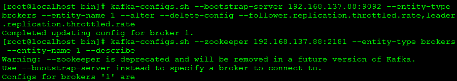
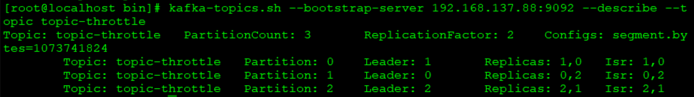

# Partition
- 分区使用副本机制，提升其可靠性
- 任意多副本只有一个leader，其余副本为follower，leader负责对外发收，follower只负责同步leader消息
- broker节点中的leader数量，体现了该节点的负载，leader越多，负载越大
- 同一个broker节点，最多只有一个某分区的副本
- 主题创建之初，kafka控制器默认会将副本的leader节点均匀的分配到各个broker节点，使负载处于相对均衡状态
- 当某个分区的leader节点发生故障，将从follower节点中选举出新的leader节点，原有leader节点恢复工作后，并不会恢复leader节点身份，如果参数auto.leader.rebalance.enable（默认true）打开，在一定时间后，会触发重分配，leader节点会重分配

- 优先副本：优先副本指在创建主题后，副本列表中首个节点号（红色列）
 
## 一、优先副本
问题场景：根据副本机制特点，当由于宕机或网络等原因导致leader节点聚集在某个broker时，会造成该节点负载过大   
 
上图为停掉某一broker节点后，leader副本转移情况，即便重启节点，原leader副本不会自动还原
### 1.自动分区平衡机制
kafka提供分区自动平衡功能，auto.leader.rebalance.enable（默认true）参数为该功能开关，功能打开时，kafka控制器将进行优先副本的重新分区平衡处理   
处理逻辑：   
- kafka控制器启动定时任务，每个leader.imbalance.check.interval.seconds（默认300s），检查每个broker节点的分区不平衡率   
```
分区不平衡率 = 非优先副本个数 / 分区总数
```
- 当不平衡率大于参数leader.imbalance.per.broker.percentage（默认10%），触发基于优先副本机制的重选举处理，以重建分区平衡
注：生产环境中，自动平衡可能导致阻塞，导致性能问题，故建议将参数设置为false，在必要时，手动进行leader的分区平衡处理

### 2. 手动分区平衡处理（所有主题）
- kafka-preferred-replica-election.sh提供了手动平衡功能，平衡过程是安全的
```
 kafka-preferred-replica-election.sh --zookeeper 192.168.137.88:2181
```
直接执行脚本，脚本将对所有的主题进行分区平衡处理，并将分区方案打印
 
- 问题：对全部主题重新分区平衡，成本较高；如果主题和分区过多，信息也可能占满zookeeper中的/admin/preferred-replica-election节点（默认1M），导致失败
注：执行过程提示“This tool is deprecated. Please use kafka-leader-election tool.”，较高版本kafka可执行
```
kafka-leader-election.sh --bootstrap-server 192.168.137.88:9092 --all-topic-partitions --election-type PREFERRED
```


### 3.手动分区平衡处理（指定分区副本方案）
kafka-preferred-replica-election.sh追加path-to-json-file + json文件路径，可实现对自定义分区副本进行平衡处理
- json文件
```
{
    "partitions": [
        {
            "topic": "topic-parts",
            "partition": 0
        },
        {
            "topic": "topic-parts",
            "partition": 1
        }
    ]
}
```
- 执行
```
 kafka-preferred-replica-election.sh --zookeeper 192.168.137.88:2181 election-rule.json
```
 

注：执行过程提示“This tool is deprecated. Please use kafka-leader-election tool.”，较高版本kafka可执行
```
kafka-leader-election.sh --bootstrap-server 192.168.137.88:9092 --election-type PREFERRED --path-to-json-file election-rule.json
```
 ## 二、分区再分配
在主题和分区创建后，再在集群中新增broker，新增的节点不会承接老节点已有的主题分区；同时，若有broker需要下线，原有节点也不会自动调整。如有增减broker节点需要，则可通过kafka-reassign-partitions.sh进行重新分区处理
 
 如把上图brokerId为1的节点下线，重新分区步骤：
- 定义重分配主题的json文件
```
{
    "topics": [
        {
            "topic": "topic-reassign",
            "partition": 0
        }
    ],  
    "version":1
}

```
- 根据上述json生成分配的配置方案
```
kafka-reassign-partitions.sh --bootstrap-server 192.168.137.88:9092 --generate --topics-to-move-json-file reassign-rule.json --broker-list 0,2
```
 

执行kafka-reassign-partitions.sh后生成两段json串：   
前段为当前主题分区配置情况，用于备份，失败后可还原；
后端为目标主题分区配置方案，需要保存为json文件，用于下一步执行；   
注：此时根据规则生成方案json，并未执行
- 执行重分配   
将重分配的方案创建json文件
```json
{
    "version": 1, 
    "partitions": [
        {
            "topic": "topic-reassign", 
            "partition": 0, 
            "replicas": [
                2, 
                0
            ], 
            "log_dirs": [
                "any", 
                "any"
            ]
        }, 
        {
            "topic": "topic-reassign", 
            "partition": 1, 
            "replicas": [
                0, 
                2
            ], 
            "log_dirs": [
                "any", 
                "any"
            ]
        }, 
        {
            "topic": "topic-reassign", 
            "partition": 2, 
            "replicas": [
                2, 
                0
            ], 
            "log_dirs": [
                "any", 
                "any"
            ]
        }
    ]
}
```
通过kafka-reassign-partitions.sh的--execute执行方案
```
kafka-reassign-partitions.sh --bootstrap-server 192.168.137.88:9092 --execute --reassignment-json-file reassign-execute.json
```
执行后，broker节点1已不再拥有该主题的分区

 

重分配原理：

1.kafka控制器为主题下的分区新增一个副本，需要临时增加副本因子；   
2.将分区副本的leader节点数据复制到新的副本中；   
3.将下线节点的旧副本清除，同时降低临副本因子。   
注：在执重分配前，建议将预下线的broker节点关闭，使不再有分区的leader副本在预下线节点，减少处理过程的流量复制。

## 三、复制限流
重分配过程中，如果某分区数据量巨大，则复制数据会占用较大资源，可能影响业务的正常处理，避免资源抢占问题。   
### 1.kafka-configs.sh限流
1.1 broker限流
```
kafka-configs.sh --bootstrap-server 192.168.137.88:9092 --entity-type brokers --entity-name 1 --alter --add-config --follower.replication.thrott
led.rate=1024,leader.replication.throttled.rate=1024
```


查看结果   
```
kafka-configs.sh --zookeeper 192.168.137.88:2181 --entity-type brokers --entity-name 1 --describe
``` 
 
关键参数：
- --entity-type：指定修改类型为brokers
- --entity-name：提供一个int型的broker id
- --alter：需要修改broker配置
- --add-config：修改类型为增加配置项
- --follower.replication.throttled.rate=1024,leader.replication.throttled.rate=1024 增加内容及参数值

1.2取消限流
```
kafka-configs.sh --bootstrap-server 192.168.137.88:9092 --entity-type brokers --entity-name 1 --alter --delete-config --follower.replication.throttled.rate,leader.replication.throttled.rate
```
 

1.3 topic限流   
类似broker限流，主题级别同样通过kafka-configs.sh进行限流处理，不过在限流时需要制定leader分区、follower分区
 

```
todo，主题限流暂存疑
```
## 四、副本因子调整
