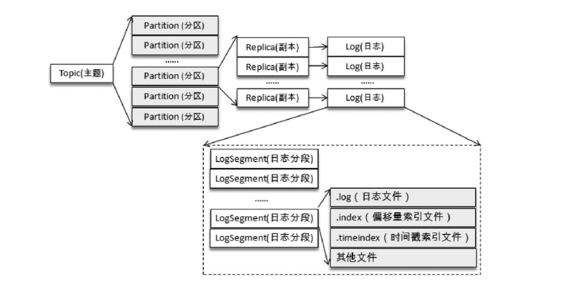
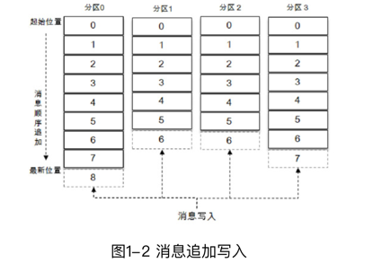
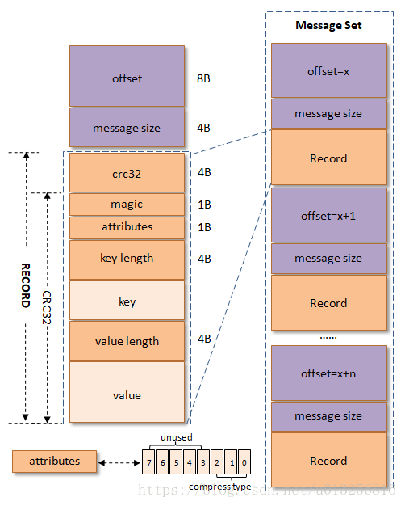
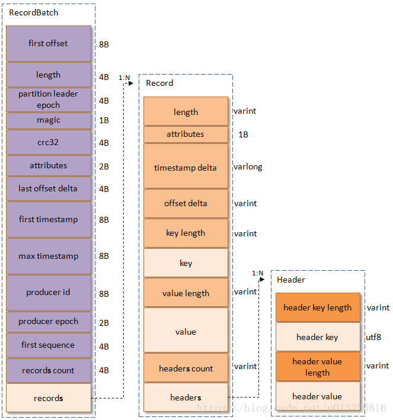
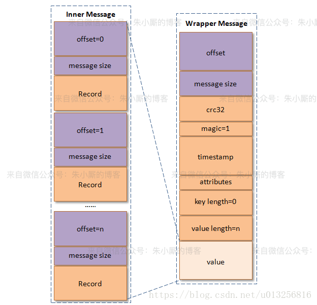
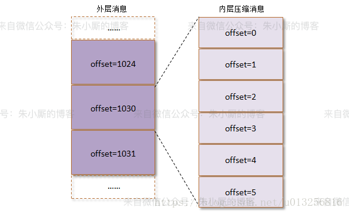

# 日志
主题有多个分区，分区有多个副本，副本对应副本日志文件，日志文件对应多个日志分段，日志分段细分为索引文件、存储文件、快照文件
## 一、文件结构
- 不考虑副本，则一个分区拥有一个Log文件夹，文件夹中包括多个LogSegment，每个LogSegment对应磁盘上的一个日志文件两个索引文件
- Log文件夹命名类似topic-name + partition，如topic-test-0、topic-test-1
- 当向Log中追加消息时，由于LogSegment是顺序性的存储，消息会追加到当前的activeSegment中，当该activeSegment满足一定条件，则创建新LogSegment，继续接受消息
- 两个索引文件分别为：offset索引文件（.index后缀）、timestamp索引文件（.timeIndex后缀）
- 每个 LogSegment 有一个baseOffset，标识当前分段第一条消息的offset
- LogSegment命名采用baseOffset，长度为20位数字，后缀为.log，如baseOffset为0，则日志、索引文件命名为
```
00000000000000000000.log
00000000000000000000.index
00000000000000000000.timeindex
```
- LogSegment还可能存在 .deleted .cleaned .swap临时文件，以及 .snapshot .txnindex等
- 创建主题时，如果log目录指定了多个，那么log文件会在分区最少的那个目录创建本次任务的文件




## 二、日志格式
日志结构的设计
- 冗余字段，会使partition消息增大，进而存储的开销变大、网络传输开销变大，Kafka性能下降
- 缺少字段，在最初的Kafka消息版本中没有timestamp字段，对内影响了日志保存、切分策略，对外影响消息审计、端到端延迟等功能的扩展，虽然可以在消息体内部添加一个时间戳，但是解析变长的消息体会带来额外的开销，而存储在消息体（参考下图中的value字段）前面可以通过指针偏量获取其值而容易解析，进而减少了开销

早期版本——v0   
 

其中，RECORD为消息格式，每个消息都对应一组offset和message size，即日志头LOG_OVERHEAD，RECORD+LOG_OVERHEAD构成一条消息，多条消息构成消息集合（Message Set）   
- crc32（4B）：crc32校验值。校验范围为magic至value之间
- magic（1B）：消息格式版本号，v0版本的magic值为0
- attributes（1B）：消息的属性。总共占1个字节，低3位表示压缩类型：0表示NONE、1表示GZIP、2表示SNAPPY、3表示LZ4（LZ4自Kafka 0.9.x引入），其余位保留
- key length（4B）：表示消息的key的长度。如果为-1，则表示没有设置key，即key=null
- key：可选，如果没有key则无此字段
- value length（4B）：实际消息体的长度。如果为-1，则表示消息为空
- value：消息体。可以为空

早期版本——v1   
 
- magic（1B）：消息格式版本号，v0版本的magic值为1
- RECORD新增了一个timestamp
- attributes字段中的低3位和v0版本的一样，还是表示压缩类型，第4个bit：0表示timestamp类型为CreateTime，而1表示timestamp类型为LogAppendTime

升级版本——v2   
此版在数据格式上改动较大，引入了变长整型Varints和ZigZag编码
- Varints：是使用一个或多个字节来序列化整数的一种方法，数值越小，其所占用的字节数就越少，但Varints并非一直会省空间，长位数反而会高于传统int
- ZigZag编码：一种锯齿形的方式来回标识正负整数，使带符号整数映射为无符号整数，绝对值较小的负数仍有较小的Varints编码值，比如-1编码为1,1编码为2，-2编码为3
- 消息集改称为Record Batch，替代Message Set
- 消息格式Record的关键字段大量采用了Varints，这样可根据具体值来确定需要几个字节
 
结构说明    
- first offset：表示当前RecordBatch的起始位移
- length：计算partition leader epoch到headers之间的长度
- partition leader epoch：用来确保数据可靠性，略
- magic：消息格式的版本号，对于v2版本而言，magic等于2
- attributes：消息属性，注意这里占用了两个字节。低3位表示压缩格式，可以参考v0和v1；第4位表示时间戳类型；第5位表示此RecordBatch是否处于事务中，0表示非事务，1表示事务。第6位表示是否是Control消息，0表示非Control消息，而1表示是Control消息，Control消息用来支持事务功能
- last offset delta：RecordBatch中最后一个Record的offset与first offset的差值。主要被broker用来确认RecordBatch中Records的组装正确性
- first timestamp：RecordBatch中第一条Record的时间戳
- max timestamp：RecordBatch中最大的时间戳，一般情况下是指最后一个Record的时间戳，和last offset delta的作用一样，用来确保消息组装的正确性
- producer id：用来支持幂等性，略
- producer epoch：和producer id一样，用来支持幂等性，略
- first sequence：和producer id、producer epoch一样，用来支持幂等性，略
- records count：RecordBatch中Record的个数

## 三、消息压缩
压缩率：把100MB的文件压缩后是90MB，压缩率为90/100*100%=90%，压缩空间越大越好，压缩率越小越好   
通常对较大的文件，压缩效果会更好，kafka消息通常比较小而数量多，所以kafka在压缩时非逐条压缩，而是将消息集进行压缩   
 

将左侧原始消息的多条，封装为一个大消息的value中，原始消息成为内部消息，消息集合成为外层消息，kafka压缩外层消息   


内外层消息的Offset为内层消息最大值，内层从0开始offset，如外层1030对应内层的offset=5   

## 四、索引日志
### 1.索引文件类型及特点
- 偏移量索引：通过消息offset找到对应物理地址的索引
- 时间戳索引：通过时间戳找到offset的索引，再通过找到的offset获取物理地址
- Kafka索引为稀疏索引，并不保证每条消息都在索引中有对应记录，稀疏索引是磁盘、内存、效率的折中方案
- 每增加一定量的数据，就会在偏移量索引、时间戳索引中增加一个索引项。通过log.index.interval.bytes参数设置每定量消息产生一个索引项，默认4k
### 2.日志分段文件\索引文件的切分
索引文件不能无限增大，其跟随日志分段文件同步切分，以下任意情形，将触发日志分段文件切分   
- 日志分段文件（注意不是索引文件）超过一定大小，一定大小指log.segment.bytes配置的大小，默认1G
- 日志分段文件（注意还不是索引文件）时间戳最大与最小时间的差值大于一定时长，一定时长指log.roll.ms或log.roll.hours，默认为7天
- 索引文件（偏移量或时间戳索引）大小超过一定大小，一定大小指log.index.size.max.bytes，默认10M
- 追加消息的偏移量 - baseoffset的值大于Integer.MAX时，因为超过计数范围，无法生成相对偏移量，需切分索引文件（注：每个 LogSegment 有一个baseOffset，标识当前分段第一条消息的offset）
### 3.索引文件大小
索引文件的读写权限、大小受限于文件对应的日志分段是否是活跃分段，即是否已经被切分
- 日志分段仍在写入，则索引文件按log.index.size.max.bytes大小创建（一新建，就是这么大），权限为可读写
- 日志分段已被切分，则索引文件亦不会再写入新的索引项，其被设定为只读，同时Kafka将索引文件剪切成实际数据大小
### 4.偏移量索引
- 索引结构   


每条索引为8个字节长度的数据，一分为二   
1.relativeOffset ：前4个字节为相对偏移量，相对指相对于baseOffset，如分段文件的baseOffset为10，relativeOffset为5，则对应消息的实际offset=15   
2.position ：后4个字节为物理地址，描述消息在所在分段中的物理地址   
注：   
    > 4个字节的相对偏移量，比绝对偏移量更节约空间；同时，也解释了为何超出Integer.MAX大小之后，日志分段文件进行切分，因为relativeOffset的4个字节无法装更大值
    > Kafka 强制要求索引文件大小必须是索引项大小的整数倍，对偏移量索引文件而言，必须为8的整数倍。如果broker端参数log.index.size.max.bytes配置为67，那么Kafka在内部会将其转换为64，即不大于67，并且满足为8的整数倍的条件   
    > 与偏移量索引文件相似，时间戳索引文件大小必须是索引项大小（12B）的整数倍，如果不满足条件也会进行裁剪。同样假设broker端参数log.index.size.max.bytes配置为67，那么对应于时间戳索引文件，Kafka在内部会将其转换为60。

- 查看索引数据   
无法直接打开索引文件直观查看索引，通过kafka-dump-log.sh可对偏移量索引的稀疏索引进行查看
```
$ka/bin/kafka-dump-log.sh --files ./00000000000000000000.index
```


注：在一条日志也未生成日志的情况下，该命令查询报NoSuchElementException
- 索引的使用   
kafka通过偏移量索引获取上图偏移量为420的消息的物理地址的流程如下   
1.先通过baseOffset找到日志所在的分片，如上图找到的即为baseOffset=0的分片的索引文件，即00000000000000000000.index
  - Kafka 的每个日志对象中使用了ConcurrentSkipListMap来保存各个日志分段，每个日志分段的baseOffset作为key，这样可以根据指定偏移量来快速定位到消息所在的日志分段。   
  
        
2.计算相对偏移量，相对偏移量 = 偏移量 - 基础偏移量 = 420 - 0 = 420   
3.在00000000000000000000.index中寻找索引项相对偏移量不大于420的最大索引记录，如图为offset=375的项   
4.offset=375的索引对应的baseOffset=0，通过kafka中跳跃表结构ConcurrentSkipListMap可获得baseOffset=0对应的日志分片   
5.在日志分片中通过position查找目标消息    
- 索引与日志分片的映射     

### 5.时间戳索引
- 索引结构   
同偏移量索引类似，由两部分组成，共12字节：   
1.timestamp：8字节，当前日志分段最大的时间戳   
2.relativeOffset：4字节，时间戳对应的消息的相对偏移量   
索引文件中存储的索引项均为12个字节的16进制，人眼查看需要转化为10进制   
- 索引约束   
1.每个追加时间戳索引项，必须大于前项，否则不会追加成功，如果log.message.timestamp.type设置为LogAppendTime，则消息时间戳可保证为单调递增，如果设置为CreateTime则取决于客户机时间，那么将无法保证   
2.索引文件大小为索引项大小的整数倍（即12B的整数倍），log.index.size.max.bytes设置为64，创建文件时kafka会创建为60（12的整数倍）   
- 索引的使用   
如需要找目标时间targetTimeStamp=1234567890000消息   
1.将targetTimeStamp和每个日志分段的largestTimeStamp进行对比，找到不小于targetTimeStamp的时间戳日志分段   
2.找到日志分段后，在对应的时间戳索引文件通过二分法查找不大于targetTimeStamp的最大索引项，获取对应的偏移量    
3.在偏移量索引文件中，查找不大于“步骤2中获取的偏移量”的索引项，获取对应的position   
4.在日志分段中查找物理位置为position开始的，时间戳不小于targetTimeStamp的消息   

## 五、日志清理
kafka每个分区都对应log日志，并拆分为多个日志文件，更易于清理和压缩处理，清理策略为两种：   
- 日志删除：按设置的策略直接删除日志分段
- 日志压缩：根据key将消息压缩，对于有相同key的不同value的值，只保留一个版本   
通过broker的log.cleanup.policy=delete\compact决定删除还是压缩，还可以同时支持两种策略“delete,compact”   
通过topic的cleanup.policy，可以对主题级别进行日志清理设置

### 1.日志删除
kafka通过一个专门的日志清除任务，轮训的进行检测和删除无需保留的日志文件，通过log.retention.check.interval.ms配置检测时间，默认5分钟，清除策略为3种
- 基于时间：根据日志分段最大的时间戳largestTimestamp，判断是否超过策略设置的清除时间，如超过，则删除   
通过broker三个粒度的参数设置：log.retention.hours \ log.retention.minutes \ log.retention.ms 时间单位越小，优先级越高   
log.retention.hours默认168，即7天   
- 基于日志大小：broker中设置的log.segment.bytes指定日志文件最大值，默认1g，超过此大小的日志，则从第一个日志分段顺序向后删除，直至满足参数   
计算日志文件的总大小，然后和配置的log.segment.bytes比较，如果超过参数值，则将超过的大小部分，从第一个日志逐个删除   
- 基于起始偏移量：通过日志当前起始偏移量logStartOffset检查，将各个日志分段中，下一分段日志起始偏移量仍小于logStartOffset的分段，进行删除   
注：起始偏移量默认是日志第一个分片的baseOffset，但可以通过kafka-delete-records.sh或java API进行修改，修改了才会有上述的删除的情形   
- 文件删除步骤   
1.先将要删除的日志分段，从跳跃表中删除，避免有其他线程请求从跳跃表读取该分段   
2.再将需删除的日志分段及分段对应的索引文件，后缀均改为.deleted   
3.后通过延迟的独立任务，删除.deleted后缀的文件   
注：文件删除延迟任务启动时间配置file.delete.delay.ms配置，默认1分钟，如果要删除的日志只有1个日志分段，则删除前需新建一个日志分段，必须保证存在一个activeSegment

### 2.日志压缩（Log Compaction）
- kafka默认为日志删除，但也可修改为日志压缩，其实并非压缩，消息传输时可通过gzip等方式compress，日志的压缩只的是compaction，是减少了消息数量的一种方式   
- 日志压缩本质是将文件中key相同的消息，只保留最新值，清除旧值对应的消息的机制   
- 压缩前后，消息的偏移量不发生变化，与写入时一致，但会生成新的日志分段文件，分段中的offset不连续，查询正常使用
- 日志压缩是基于消息中的key，故此方式key不可以为null
- 日志删除是删除整个分段，日志压缩是针对相同key的消息进行合并清理，组成新分段

## 六、kafka磁盘存储特点

### 1.顺序追加
- kafka工作以文件系统来存储和缓存消息
- 磁盘线性写入速度到600M/s以上（RAID5），而随机写入只能在100K/s左右
- kafka采用文件追加方式写入消息，且不允许修改已经写入的消息，所以属于典型的顺序写磁盘，故吞吐量较大

### 2.页缓存
- 概念   
1.页缓存是操作系统实现的磁盘缓存，该技术能够减少磁盘IO操作，本质是将磁盘数据缓存到内存中，把对磁盘的访问转为对内存的访问   
2.当程序进程预读取磁盘数据时，操作系统先查看目标数据在页缓存中是否存在，如存在则直接返回，不存在，则读取磁盘，并将读取数据存入页缓存，再返回给进程   
- kafka用页缓存的优势   
    1.不论kafka或其他应用是否使用页缓存，页缓存也都随着操作系统的工作而存在，不会省略掉   
    2.若使用java技术处理缓存，对象的内存开销比实际数据大几倍，空间使用效率低下，同时GC会有性能开销   
    3.直接使用页缓存相当于利用里1的既有特性，不需要独立维护一套缓存结构；同时，避免2中的短板，通过自定义的日志的紧凑结构节省内存空间；也不用考虑页缓存和文件之间一致性问题，因为操作系统会解决   
    4.页缓存是kafka实现高吞吐量的因素之一

### 3.零拷贝
- 零拷贝指将数据直接从磁盘文件复制到网卡设备，而链路中不经过程序，这样减少了内核与用户模式之间的切换
- 常规模式   
常规情况下，将磁盘某文件F发送给远端，底层处理需要四步骤：   
1.将F内容复制到内核模式   
2.CPU将内核模式数据复制到用户模式   
3.用户模式内容复制到内核模式下的SocketBuffer   
4.将内核模式下SocketBuffer数据复制到网卡设备，发送到远端   
上述步骤中的2、3步骤为冗余复制，降低性能   

- 零拷贝模式   
零拷贝模式直接在内核模式把磁盘中的数据传输给Socket，减少了向用户模式传输的过程，提升了性能   

