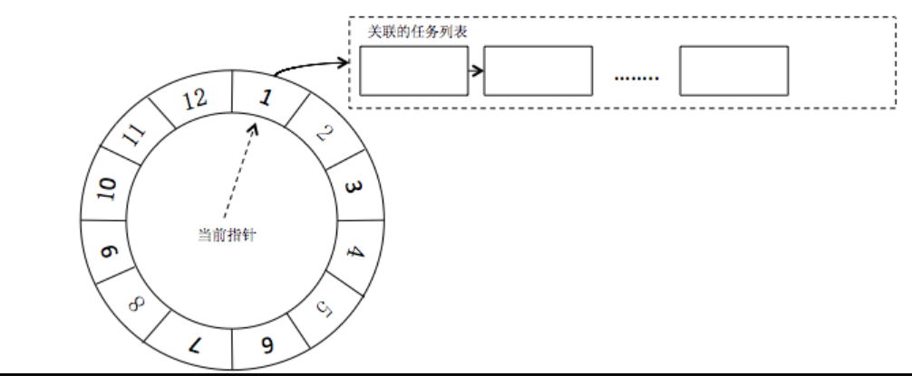
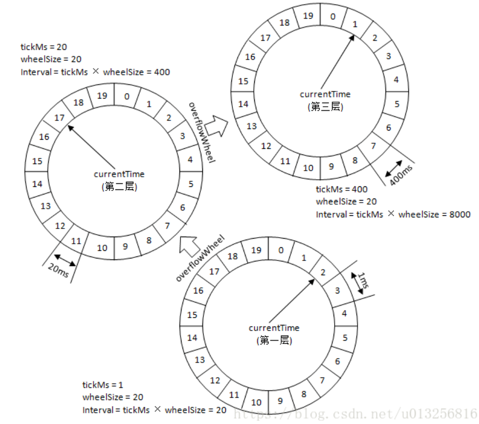
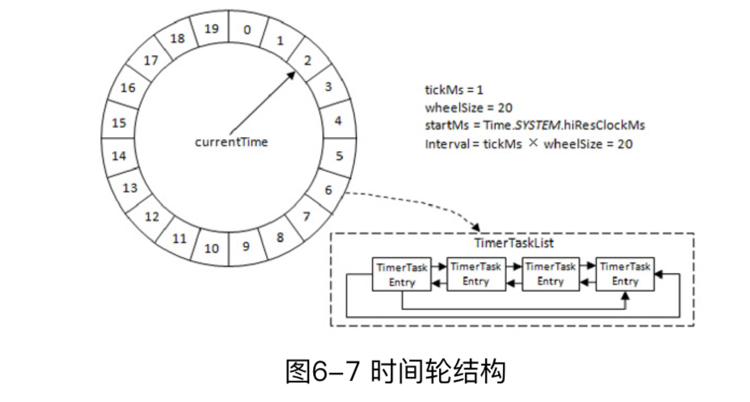

# Server
## 一、协议
Kafka自定义了一组二进制TCP协议，每种类型的协议都有对应的request、response，Request包括RequestHeader和RequestBody   
### 1.Request
#### Header
- api_key：API标识，标识请求的类型是拉取或生产等，如0标识produce请求
- api_version：API版本
- client_id：客户端id
- correlation_id：本次请求相关id，相关id会被在响应中传递会请求端，请求端根据此id与请求对应，识别是哪个请求的响应   
注：所有类型的请求，对应的响应，其头文件相同及RequestHeader与ResponseHeader结构相同，Body不同
#### Body
例举ProduceRequestBody
- transactional_id：事务id，不使用事务则null
- acks：客户端中的acks参数，即分区中必须要有多少个副本收到消息，生产者才认为消息是发送成功
- timeout：请求超时时间，默认30s，客户端request.timeout.ms配置
- topic_data：发送数据的集合数组，以主题名称分类，包括：   
1.topic：主题名
2.data：主题数据，其下包括partition（分区号）、record_set(消息数据)

### 2.Response
例举ProduceResponse
- throttle_time_ms：超过配额限制需要延迟该请求的处理时间，无配额值为0
- response：类似请求的topic_data，是一个数组，包括：   
1.topic：主题名   
2.partition_responses:所有分区的响应，旗下包括partition（分区号）、error_code、base_offset、log_append_time、log_start_offset

其他拉取等协议类似

## 二、时间轮
- kafka中存在延时动作，如：延时生产、消费、删除等行为
- Java中Timer、DelayQueue时间复杂度O(nlogn)
- 自定义时间轮复杂度O(1)
- 多种开源项目均有时间轮身影：zookeeper、Netty、Quartz等

### 1.时间轮结构
时间轮结构类似机械表齿轮机制：   
秒针齿轮转动60m进入分针齿轮1个单位，分针齿轮转动60分针进入时针1个单位，时针12个单位一周   
#### 单轮   
- 时间轮是一个环形队列，包含固定数量的时间格（wheelSize），每个室间隔的时间跨度相同（tickMs），即整个时间轮的时间跨度也是固定的   
- 时间轮上有一个表盘指针，即currentTime，代表当前进行的时间，时间在环内流逝，将环分为到期部分、未到期部分   
- 时间轮上的每个时间格，指向一个定时任务列表——TimerTaskList，TimerTaskList又为环形双向链表，列表中每个元素都是定时任务TimerTaskEntry
- 若时间轮每格为1ms，wheelSize=20，总跨度为20ms。初始时指针指向0ms（途中展示为第1格）   
当有任务为2ms启动时，则该任务储存在2ms对应的TimerTaskList中，当currentTime到达2ms，TimerTaskList下的任务执行   
执行到2ms时，若又新增一个8ms后要执行的任务，则在2ms基础上+8ms，及存入10ms时间格对应的TimerTaskList中   
若此时新增一个350ms后要执行的任务呢？就需要引入多级轮结构的情形了

#### 多轮
- 多级时间轮结构类似：时间轮分多层级，每个层级都偶tickMs、wheelSize，每上升一个层级，tickMs是其下级的时间跨度之和，wheelSize相等
- 多级时间轮量级渐进：如最低级tickMs=1ms，wheelSize=20，总跨度20ms，则其上级tickMs=20ms，wheelSize=20，总跨度400ms，以此类推，第三层级为8000ms，第四层级为160000ms
- 根据总时间跨度绝对时间轮升级：当一层时间轮的度量，无法承载预期任务计划的时间长度时，如单轮时间机制描述的wheelSize=20ms的轮遇到350ms的任务情况，则任务升级到上一级时间轮的17个时间片（350/20），如果另有任务大于400ms，则再升级时间轮，以此类推
- 根据流逝后剩余时间决定时间轮降级：如350ms的任务在二级时间轮，当时间流逝至340ms时，剩余10ms的时间在当前时间轮无法精确描述，则降级至低级时间轮，在低级时间轮经理10个时间片后，开始执行任务   

#### 扩展
- 时间轮在创建时，以系统当前时间为第一层时间轮的起始时间
- 通过TimeSYSTEM.hiResClockMs获取精确时间，System.currentTimeMillis()在某些操作系统下不能组合精确到毫秒级
- 除了第一层时间轮，后续高级的时间轮的的起始时间都设置为创建此层时间轮时，前一层级时间轮的currentTime

## 三、延时操作
### 生产者产生消息服务端的延时处理
- 生产者客户端将acks设置为-1，即所有ISR集合的分区副本均需要完成消息同步，才视为完成，否则异常
- 加入某分区有3个副本，即leader、follower1、follower2，那么Produce生成一批消息先将消息写入leader，并在一定时间内follower1、follower2要完成消息拉取，否则返回超时异常
- 一定时间配置于：request.timeout.ms，默认30000ms
- 上述处理中，返回响应结果即为一个延时处理，服务端将消息写入leader副本的日志文件后，随即创建一个延时操作，用于处理消息完成写入或超时返回客户端的行为
### 延时操作细节
- 种类：kafka有很多种延时操作，上例的生产，以及拉取、删除等操作均伴有后台的延时操作
- 要素：   
1.延时操作有超时时间，逾期则强制返回；   
2.延时操作支持外部事件触发，即不同于定时任务的到期执行，在未到期时有外部事件可触发延时操作返回结果
- 外部事件：如生产操作的外部事件即为写入消息对应分区的WH增长，因为只有所有的follower都同步拉取完成，则该分区WH才真正增长，增长时判断是否增长至预期目标值，如达到目标值，则触发延时任务返回响应结果，完成本次交互
- 定时器：延时操作管理器会配备一个定时器，底层采用时间轮计时

## 四、控制器
kafka集群中有一个broker（同一时间仅会有一个）会被选为控制器（controller），用于处理整个集群中分区和副本状态：
- 当某分区leader副本故障，控制器负责选举新 leader副本
- 当某分区leader的ISR集合变化，控制器通知所有broker更新元数据
- 当某个topic增加分区数量，控制器负责分区的重新分配
### 选举
- 控制器选举依赖zookeeper，zookeeper下创建controller节点保存控制器信息，其中包括控制器broker id及当选时间（时间戳）
- 正常选举过程：   
1.broker启动时，读取zookeeper下的controller节点   
2.当节点中brokerid值不为-1，则表示已有broker当选为控制器，不再竞选   
3.当节点中不存在controller节点，就尝试创建/controller节点，成为控制器（可能同时有多个创建者，只有成功的那一个当选）   
### 退位
- 每个broker会对/controller节点添加监听器，当节点数据发生变化时，broker会更新自身内存中保存的activeController
- 如果broker自身是控制器，但在数据变更后自身的broker id已不再是控制器，则其自动退位，关闭资源、状态机、监听等
- controller节点被删除、人工修改、controller的broker被关闭等行为都会导致退位处理，开启新一轮选举
### 纪元(epoch)
- zookeeper下的/controller_epoch记录控制器纪元，即当前为第几代控制器
- epoch值默认为1，每选出一个新控制器，值加1
- 当与控制器交互时，请求需携带epoch值，如携带值小于当前zookeeper的epoch值，则认为是该请求是向已故控制器发送的请求，请求作废；当携带值大于当前zookeeper的epoch值，则带表有新的控制器当选了
- controller_epoch用来保证控制器的唯一性
### 职责
不同于非控制器节点，controller broker额外承担如下职责
- 监听分区变化
- 监听主题变化
- 监听broker变化
- 启动并管理分区状态机和副本状态机
- 更新集群元数据信息
- 维护优先副本均衡（如参数开启）等
### 事件
控制器对于多节点多行为的监听器、定时任务等触发的事件，若采用多线程处理，则将产生大量同步处理带来的性能下降，故kafka控制器使用单线程事件队列的模型，将事件封装后按时间先后存储为LinkedBlockingQueue，再通过专用线程以先入先出原则逐个处理

## 五、分区leader选举
几种情况，将产生分区leader的选举行为
- 创建分区或原leader下线，需要执行leader选举，此时执行OfflinePartitionLeaderElectionStrategy：在AR集合中副本顺序查找第一个存活副本，且副本在ISR集合中，如果ISR中午任何副本，则检查unclean.leader.election.enable，若为true，则可从ISR之外选取leader副本
- 当分区进行重分配时，此时执行ReassignPartitionLeaderElectionStrategy：在AR集合中副本顺序查找第一个存活副本，且副本在ISR集合中
- 当进行优先副本选举时，执行PreferReplicaPartitionLeaderElectionStrategy：直接将优先副本作为leader，AR中的第一个副本即为优先副本
- 当节点被关闭时（非暴力关闭或下线），执行ControllerShutdownPartitionLeaderElectionStrategy：在AR集合中副本顺序查找第一个存活副本，且副本在ISR集合中，其副本不是正在关闭的节点的副本

## 六、核心参数
### broker.id
- 默认值-1，broker.id必须大于0才能正常启动，故此默认值必须修改才能使用kafka
- broker在启动时会在Zookeeper的/brokers/ids下创建以brokerId为名称的虚节点，其他broker节点或客户端查看该路径下的节点即可知晓有几个broker
- 较多的broker情形，kafka提供了自动生成brokerId功能，通过broker.id.generation.enable和reserved.broker.max.id参数配合生成brokerId   
两个参数配合使用，自动生成kafka的brokerId   
broker.id.generation.enable默认为false，即不自动生成，设置为true时，开启自动生成brokerId   
自动生成brokerId有一个基准值，自动生成的id必须大于此基准，reserved.broker.max.id即为基准值，默认1000，则0-1000留给手动设置，1000以上为自动设置   
- 额外关注一下自动生成brokerId的原理：kafka在zookeeper的/brokers/seqid节点先写入一个空字符串，即该节点version=0版本为空串，后续取号，先写一个数值，然后获取version，用获取的version与reserved.broker.max.id相加，确保自动生成的版本是不重复且大于基准值的
### bootstrap.servers
- 误解：通常认为该参数就是kafka集群服务器地址集合
- 本质：从底层工作的真实意义来看，该参数是kafka集群元数据信息的服务地址，理论上元数据提供服务与kafka是可以剥离开看待的
- 使用：在一些脚本中，如kafka-console-consumer.sh，--bootstrap-servers 已经替代--zookeeper选项，但非所有脚本均替代，如kafka-topics.sh，由于其操作的就是zookeeper，而不是kafka，故没有取缔--zookeeper的必要

