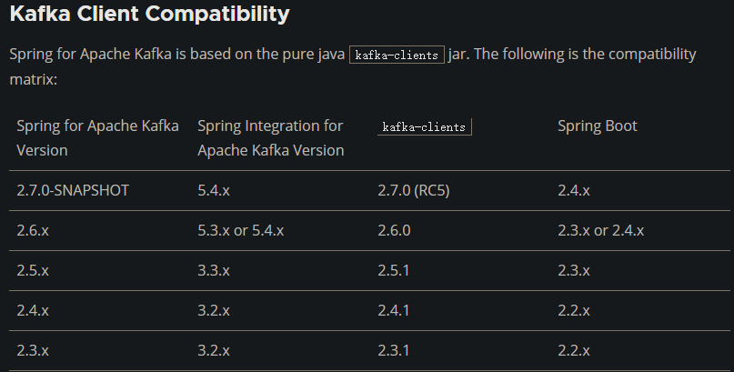
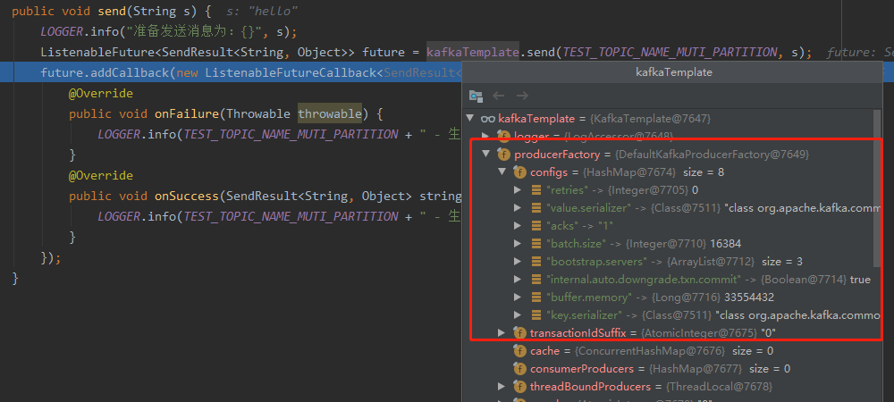
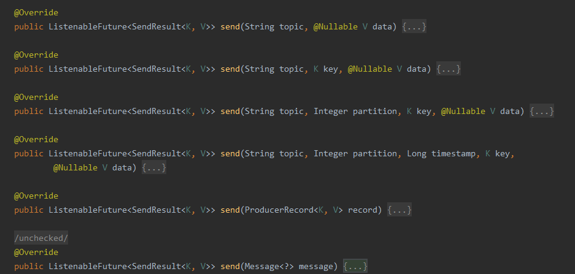
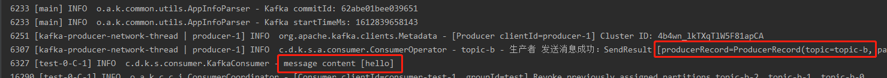

# Kafka & Spring
## 集成
基于springboot集成
- pom.xml增加依赖
```
        <dependency>
            <groupId>org.apache.kafka</groupId>
            <artifactId>kafka-clients</artifactId>
            <version>2.6.0</version>
        </dependency>
        <dependency>
            <groupId>org.springframework.kafka</groupId>
            <artifactId>spring-kafka</artifactId>
            <version>2.6.4</version>
        </dependency>
```
注：需要在spring官网查看kafka与spring版本关系   

- 在application.yml文件增加springboot中kafka相关配置
```
spring:
  kafka:
    bootstrap-servers: 192.168.137.88:9092,192.168.137.89:9092,192.168.137.90:9092
    producer:
      retries: 0
      batch-size: 16384
      buffer-memory: 33554432
      key-serializer: org.apache.kafka.common.serialization.StringSerializer
      value-serializer: org.apache.kafka.common.serialization.StringSerializer
      acks: 1
    consumer:
      auto-commit-interval: 1S
      auto-offset-reset: latest
      enable-auto-commit: false
      key-deserializer: org.apache.kafka.common.serialization.StringDeserializer
      value-deserializer: org.apache.kafka.common.serialization.StringDeserializer
```
配置内容与官网各个配置项对应，不配置的为默认值

## hello级使用
### producer
```
@Component
public class KafkaProducer {
    private final static Logger LOGGER = LoggerFactory.getLogger(ConsumerOperator.class); 
    @Resource
    private KafkaTemplate<String, Object> kafkaTemplate;
    public void send(String s) {
        LOGGER.info("准备发送消息为：{}", s);
        ListenableFuture<SendResult<String, Object>> future = kafkaTemplate.send(TEST_TOPIC_NAME_MUTI_PARTITION, s);
        future.addCallback(new ListenableFutureCallback<SendResult<String, Object>>() {
            @Override
            public void onFailure(Throwable throwable) {
                LOGGER.info(TEST_TOPIC_NAME_MUTI_PARTITION + " - 生产者 发送消息失败：" + throwable.getMessage());
            }
            @Override
            public void onSuccess(SendResult<String, Object> stringObjectSendResult) {
                LOGGER.info(TEST_TOPIC_NAME_MUTI_PARTITION + " - 生产者 发送消息成功：" + stringObjectSendResult.toString());
            }
        });
    }
}
```
Spring负责将KafkaTemplate实例化，实例中读取了yml中的配置     
   
send包括多种重载方法    


### consumer
```
@Component
public class KafkaConsumer {
    private Logger LOGGER = LoggerFactory.getLogger(KafkaConsumer.class);

    @KafkaListener(id= "test",topics = "topic-b")
    public void listen1(String message) {
        LOGGER.info("message content [{}]", message);
    }
}
```
@KafkaListener负责监听指定topics的消息

### 测试
```
@RunWith(SpringRunner.class)
@SpringBootTest
public class KafkaProducerTest {
    @Resource
    KafkaProducer kafkaProducer;
    @Test
    public void sendTest() throws InterruptedException {
        kafkaProducer.send("hello");
        Thread.sleep(10000);
    }
}
```


## 集成原理
### yml配置如何装配为容器中的对象
关键逻辑在org.springframework.boot.autoconfigure.kafka.KafkaAutoConfiguration，负责kafka的配置和Bean初始化
```
@Configuration(proxyBeanMethods = false)
@ConditionalOnClass(KafkaTemplate.class)
@EnableConfigurationProperties(KafkaProperties.class)
@Import({ KafkaAnnotationDrivenConfiguration.class, KafkaStreamsAnnotationDrivenConfiguration.class })
public class KafkaAutoConfiguration {
    ...
}
```
- @Configuration(proxyBeanMethods = false)：定义KafkaAutoConfiguration为配置类，且将bean代理设置为false
- proxyBeanMethods：默认为true，设置类中@Bean注解标注的方法是否使用代理，如果使用代理容器中只有一个bean实例，如：   
存在@Bean methodA、@Bean methodB两个方法，proxyBeanMethods=true，methodB方法调用了methodA，其获取的实例和methodA返回给容器的实例是一个；proxyBeanMethods=false，则methodA产生一个实例，methodB产生一个新的实例。据称false方式能够提高性能   
- @ConditionalOnClass(KafkaTemplate.class)：执行条件注解，只有当工程环境中存在KafkaTemplate.class才生成实例，否则不作为
- @EnableConfigurationProperties(KafkaProperties.class)：启用KafkaProperties与yml配置文件绑定，KafkaProperties的@ConfigurationProperties(prefix = "spring.kafka")对应到yml
- @Import在生成实例的同时，也生成KafkaAnnotationDrivenConfiguration、KafkaStreamsAnnotationDrivenConfiguration的实例，使用@Import导入相对灵活，避免了直接在导入类中@Component却不使用的浪费情况

```
@ConfigurationProperties(prefix = "spring.kafka")
public class KafkaProperties {
    ...
}
```