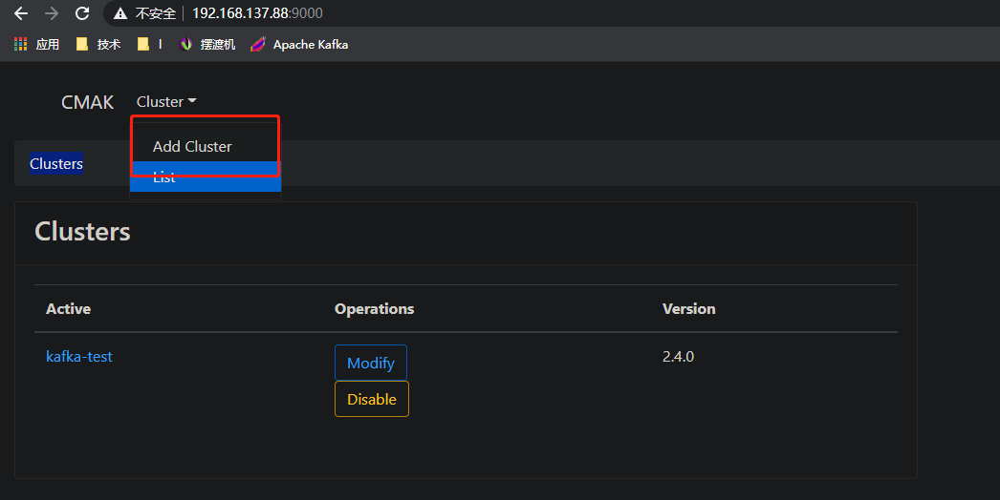
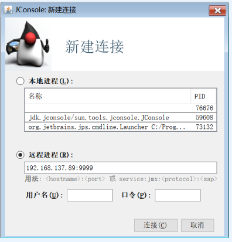

# Monitor
- kafka监控维度主要分为集群信息、broker、topic、消费等部分
- 监控方式用两种：   
1.使用成型的开源工具，优点快速简单，缺点无法与自建系统融合并建立个性化监控管理   
2.通过JMX获取关键数据自行实现监控程序，优缺点与开源工具相反   

## CMAK(Cluster Manager for Apache Kafka)
雅虎开源工具，简单部署即可使用，提供有监控、管理功能
### 安装
1.获取   
https://github.com/yahoo/CMAK获取release压缩包   
下载不了从百度网盘下载：https://pan.baidu.com/s/12Bn_8MjzcFUsAYawarPEvQ 提取码：9527  
  
2.配置   
- 解压至服务器
```
unzip cmak-3.0.0.4.zip -d /xx_path
```
- 修改配置  
```
vi conf/application.conf 
```

- 启动
```
nohup bin/cmak -Dconfig.file=conf/application.conf &
```
### 增加集群配置
首先确保kafka正常工作后，浏览器访问：ip:9000即可，9000是默认端口，可以在启动脚本修改默认端口号



### 集群信息

### 主题信息

### 管理功能
    
进入集群后，有很多管理功能，如增加主题、分区、优化副本等，都能对应到kafka/bin下的脚本工具，只不过增加了可视化支持

## 自定义监控
### 监控方式——JMX
- 开启JXM   
通过在启动Kafka时增加JMX_PORT=9999参数，开启JMX，打通获取监管数据的大门
```
JMX_PORT=9999 nohup kafka-server-start.sh ../config/server.properties &
```


- Jconsole查看监控内容   
使用JDK中自带的Jconsole工具，可与上步JXM的对接，获取监控信息   
选择远程进程，录入：IP:端口即可   

    
注：若无法连接可查看防火墙是否关闭、网络端口是否开放、目标端的hostname -i是否为录入IP（而非127.0.0.1）   

    
建立连接后可查看目标服务的多维度监控信息，对于Kafka的监控内容，需要看MBean部分

    
MBean界面左侧的树结构定义了可查看kafka的各类维度，如Log下的LogEndOffset可获取不同topic的偏移量情况   
整个MBean内容是自定义监控的数据基础或者理解为API，通过Java代码可读取所有项信息，建立符合自身需求的监控模块

### Java获取JMX目标信息
以获取上述截图的LogEndOffset为例，通过java如下获取
- 建立连接类
```
public class JmxConnection {
    private static Logger log = LoggerFactory.getLogger(JmxConnection.class);

    private MBeanServerConnection conn;
    private String jmxURL;
    private String ipAndPort = JMX_HOST_PORT;
    private int port = 9999;
    private boolean newKafkaVersion = false;

    public JmxConnection(Boolean newKafkaVersion, String ipAndPort){
        this.newKafkaVersion = newKafkaVersion;
        this.ipAndPort = ipAndPort;
    }

    public boolean init(){
        jmxURL = "service:jmx:rmi:///jndi/rmi://" +ipAndPort+ "/jmxrmi";
        log.info("init jmx, jmxUrl: {}, and begin to connect it",jmxURL);
        try {
            JMXServiceURL serviceURL = new JMXServiceURL(jmxURL);
            JMXConnector connector = JMXConnectorFactory.connect(serviceURL,null);
            conn = connector.getMBeanServerConnection();
            if(conn == null){
                log.error("get connection return null!");
                return  false;
            }
        } catch (MalformedURLException e) {
            e.printStackTrace();
            return false;
        } catch (IOException e) {
            e.printStackTrace();
            return false;
        }
        return true;
    }

    private Object getAttribute(ObjectName objName, String objAttr){
        if(conn== null)
        {
            log.error("jmx connection is null");
            return null;
        }

        try {
            return conn.getAttribute(objName,objAttr);
        } catch (MBeanException e) {
            e.printStackTrace();
            return null;
        } catch (AttributeNotFoundException e) {
            e.printStackTrace();
            return null;
        } catch (InstanceNotFoundException e) {
            e.printStackTrace();
            return null;
        } catch (ReflectionException e) {
            e.printStackTrace();
            return null;
        } catch (IOException e) {
            e.printStackTrace();
            return null;
        }
    }

    /**
     * @param topicName
     * @return 获取topicName中每个partition所对应的logSize(即offset)
     */
    public Map<Integer,Long> getTopicEndOffset(String topicName){
        Set<ObjectName> objs = getEndOffsetObjects(topicName);
        if(objs == null){
            return null;
        }
        Map<Integer, Long> map = new HashMap<>();
        for(ObjectName objName:objs){
            int partId = getParId(objName);
            Object val = getAttribute(objName,"Value");
            if(val !=null){
                map.put(partId,(Long)val);
            }
        }
        return map;
    }

    private int getParId(ObjectName objName){
        if(newKafkaVersion){
            String s = objName.getKeyProperty("partition");
            return Integer.parseInt(s);
        }else {
            String s = objName.getKeyProperty("name");

            int to = s.lastIndexOf("-LogEndOffset");
            String s1 = s.substring(0, to);
            int from = s1.lastIndexOf("-") + 1;

            String ss = s.substring(from, to);
            return Integer.parseInt(ss);
        }
    }

    private Set<ObjectName> getEndOffsetObjects(String topicName){
        String objectName;
        if (newKafkaVersion) {
            objectName = "kafka.log:type=Log,name=LogEndOffset,topic="+topicName+",partition=*";
        }else{
            objectName = "\"kafka.log\":type=\"Log\",name=\"" + topicName + "-*-LogEndOffset\"";
        }
        ObjectName objName = null;
        Set<ObjectName> objectNames = null;
        try {
            objName = new ObjectName(objectName);
            objectNames = conn.queryNames(objName,null);
        } catch (MalformedObjectNameException e) {
            e.printStackTrace();
            return  null;
        } catch (IOException e) {
            e.printStackTrace();
            return null;
        }
        return objectNames;
    }
}
```
- 获取指定主题LogEndOffset类
```
public class JmxMgr {
    private static Logger log = LoggerFactory.getLogger(JmxMgr.class);
    private static List<JmxConnection> conns = new ArrayList<>();

    public static boolean init(List<String> ipPortList, boolean newKafkaVersion){
        for(String ipPort:ipPortList){
            log.info("init jmxConnection [{}]",ipPort);
            JmxConnection conn = new JmxConnection(newKafkaVersion, ipPort);
            boolean bRet = conn.init();
            if(!bRet){
                log.error("init jmxConnection error");
                return false;
            }
            conns.add(conn);
        }
        return true;
    }

    public static Map<Integer, Long> getEndOffset(String topicName){
        Map<Integer,Long> map = new HashMap<>();
        for(JmxConnection conn:conns){
            Map<Integer,Long> tmp = conn.getTopicEndOffset(topicName);
            if(tmp == null){
                log.warn("get topic end offset return null, topic {}", topicName);
                continue;
            }
            for(Integer parId:tmp.keySet()){//change if bigger
                if(!map.containsKey(parId) || (map.containsKey(parId) && (tmp.get(parId)>map.get(parId))) ){
                    map.put(parId, tmp.get(parId));
                }
            }
        }
        return map;
    }

    public static void main(String[] args) {
        List<String> ipPortList = new ArrayList<>();
        ipPortList.add(JMX_HOST_PORT_1);
        ipPortList.add(JMX_HOST_PORT_2);
        JmxMgr.init(ipPortList,true);

        String topicName = TEST_TOPIC_NAME_MUTI_PARTITION;
        System.out.println(getEndOffset(topicName));
    }
}
```
运行结果如下   
    
在此只获取了两个broker节点的LogEndOffset信息，在实际生产中需要获取所有broker节点的数据，并根据指标不同进行汇总、最大等处理，才是真实的集群监控指标

部分代码源自：https://hiddenpps.blog.csdn.net/