# Command-Line Tools
Kafka安装目录中bin下的脚本执行。
## kafka_topics.sh
 参数说明：
- --alter 修改topic配置关键字，修改分区、副本或其他主题配置
- --bootstrap-server REQUIRED，脚本连接的Kafka服务器地址
- --config 修改并覆盖topic创建之初的参数
- --delete-config 移除覆盖的topic参数
- --create 创建topic的动作指令
- --delete 删除主题
- --describe 展示topic的动作指令
- --replication-factor 副本因子
- --partitions 分区个数
- --zookeeper DEPRECATED，作用同bootstrap-server，对早期版本的支持（0.9以前，通过zookeeper）
### 1.创建topic
- 基础款：采用默认配置创建topic
```
kafka-topics.sh --create --topic topic-a --bootstrap-server 192.168.137.88:9092
```

- 定制款A：指定分区、副本创建topic，覆盖部分默认参数
```
kafka-topics.sh --bootstrap-server 192.168.137.88:9092 --create --topic topic-name  --partitions 4 --replication-factor 2
--config max.message.bytes=20000
```
--partitions：指定分区数量   
--replication-factor：指定副本因子   
--config：指定需要覆盖的参数

- 定制款B：指定分区及副本分配方案创建topic 
```
kafka-topics.sh --bootstrap-server 192.168.137.88:9092 --create --topic topic-name --replica-assignment 2:0,0:1,1:2,2:1
```
此方式隐含了分区数量、副本，故不必显示--partitions、--replication-factor   
2:0,0:1,1:2,2:1代表4个分区、3个副本，其中，不同分区用“,”间隔，如上为4个分区指定分配情况，每个分区为副本分配的broker用“:”间隔

### 2.查看topic
- 指定topic：指定topic名，获取topic详细信息
```
kafka-topics.sh --describe --topic topic-a --bootstrap-server 192.168.137.88:9092
```
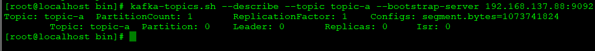
- 获取topic列表
```
kafka-topics.sh --list --bootstrap-server 192.168.137.88:9092
```

- 查看覆盖配置的topic
```
kafka-topics.sh --describe --bootstrap-server 192.168.137.88:9092 --topics-with-overrides
```
### 3.删除topic
- 通过topic名删除，多个用逗号分隔
```
kafka-topics.sh --delete --topic topic-1,topic-2 --bootstrap-server 192.168.137.88:9092
```
### 4.修改topic
- 修改分区
```
kafka-topics.sh --alter --partitions 4 --topic topic-a --bootstrap-server 192.168.137.88:9092
```
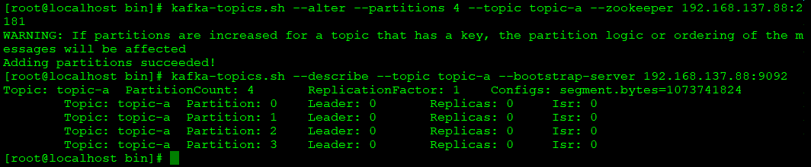   
注：不能改小，只能改大

- 修改topic配置
```
只修改分区
kafka-topics.sh --bootstrap-server 192.168.137.88:9092 --alter --topic topic-config --partitions 4
修改分区和属性 
kafka-topics.sh --zookeeper 192.168.137.88:2181 --alter --topic topic-config --partitions 6 --config segment.bytes=100000000
```
- 删除topic配置，恢复默认配置
```
kafka-topics.sh --zookeeper 192.168.137.88:2181 --alter --topic topic-config --delete-config segment.bytes
```

## kafka-preferred-replica-election.sh
较早版本kafka，如果存在broker节点分区负载较大，且未开启自动平衡参数（auto.leader.rebalance.enable），可手动平衡  
- 全部主题重新分区平衡
```
kafka-preferred-replica-election.sh --zookeeper 192.168.137.88:2181
```
注：脚本对全部主题重新分区平衡，成本较高；如果主题和分区过多，信息也可能占满zookeeper中的/admin/preferred-replica-election节点（默认1M），导致失败

- 指定主题、分区重新分区平衡
```
kafka-preferred-replica-election.sh --zookeeper 192.168.137.88:2181 election-rule.json
```
json样例   
```
{
    "partitions": [
        {
            "topic": "topic-parts",
            "partition": 0
        },
        {
            "topic": "topic-parts",
            "partition": 1
        }
    ]
}
```
## kafka-leader-election.sh
2.6.0版本kafka:
- 全部主题重新分区平衡
```
kafka-leader-election.sh --bootstrap-server 192.168.137.88:9092 --all-topic-partitions --election-type PREFERRED
```
- 指定主题重新分区平衡
```
kafka-leader-election.sh --bootstrap-server 192.168.137.88:9092 --election-type PREFERRED --path-to-json-file election-rule.json
```

## kafka-reassign-partitions.sh
在新增、分区重分配处理
- 定义重分配主题的json文件
```
{
    "topics": [
        {
            "topic": "topic-reassign",
            "partition": 0
        }
    ],  
    "version":1
}

```
- 根据上述json生成分配的配置方案
```
kafka-reassign-partitions.sh --bootstrap-server 192.168.137.88:9092 --generate --topics-to-move-json-file reassign-rule.json --broker-list 0,2
```
- 执行重分配   
将重分配的方案创建json文件
```json
{
    "version": 1, 
    "partitions": [
        {
            "topic": "topic-reassign", 
            "partition": 0, 
            "replicas": [
                2, 
                0
            ], 
            "log_dirs": [
                "any", 
                "any"
            ]
        }, 
        {
            "topic": "topic-reassign", 
            "partition": 1, 
            "replicas": [
                0, 
                2
            ], 
            "log_dirs": [
                "any", 
                "any"
            ]
        }, 
        {
            "topic": "topic-reassign", 
            "partition": 2, 
            "replicas": [
                2, 
                0
            ], 
            "log_dirs": [
                "any", 
                "any"
            ]
        }
    ]
}
```
通过kafka-reassign-partitions.sh的--execute执行方案
```
kafka-reassign-partitions.sh --bootstrap-server 192.168.137.88:9092 --execute --reassignment-json-file reassign-execute.json
```
执行后，broker节点1已不再拥有该主题的分区

## kafka-config.sh
关键参数：
- --entity-type：指定修改类型为brokers
- --entity-name：提供一个int型的broker id
- --alter：需要修改broker配置
- --add-config：修改类型为增加配置项   
不同类型对象可修改的属性，通过--help查询
### 1.增加配置
entity-type topic
```
 kafka-configs.sh --bootstrap-server 192.168.137.88:9092 --alter --entity-type topics --entity-name topic-b --add-config 'max.message.bytes=50000000,flush.ms=100000'
```
修改配置于增加配置一致，直接修改属性值即可
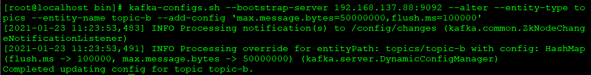 

### 2.删除配置
```
 kafka-configs.sh --bootstrap-server 192.168.137.88:9092 --alter --entity-type topics --entity-name topic-b --delete-config 'max.message.bytes,flush.ms'
```
 

### 3.查看配置
```
 kafka-configs.sh --bootstrap-server 192.168.137.88:9092 --describe --entity-type topics --entity-name topic-b
```
可以获取修改过的配置

### 4.限流   
- 复制限流
```
kafka-configs.sh --bootstrap-server 192.168.137.88:9092 --entity-type brokers --entity-name 1 --alter --add-config --follower.replication.thrott
led.rate=1024,leader.replication.throttled.rate=1024
```
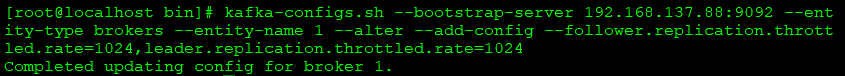 

- --follower.replication.throttled.rate=1024,leader.replication.throttled.rate=1024 增加内容及参数值

- 取消复制限流
```
kafka-configs.sh --bootstrap-server 192.168.137.88:9092 --entity-type brokers --entity-name 1 --alter --delete-config --follower.replication.throttled.rate,leader.replication.throttled.rate
```

## kafka-console-producer.sh
Producer参数说明：
- --bootstrap-server 目标Kafka服务
- --broker-list 同--bootstrap-server，均可表示目标Kafka服务
- --topic 目标topic
### 1.无key数据
```
kafka-console-producer.sh --topic topic-a --bootstrap-server 192.168.137.88:9092
```
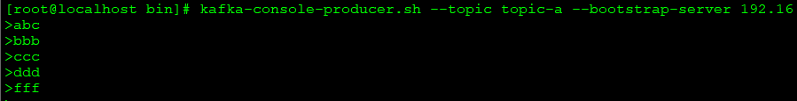

### 2.带key数据
```
kafka-console-producer.sh --topic topic-a --bootstrap-server 192.168.137.88:9092 --property parse.key=true
```
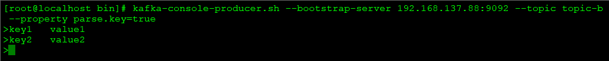   
注：key与value之间需要用tab分隔

## kafka-console-consumer.sh
### 1.即时消费
不会追溯历史消息
```
kafka-console-consumer.sh --topic topic-a --bootstrap-server 192.168.137.88:9092
```
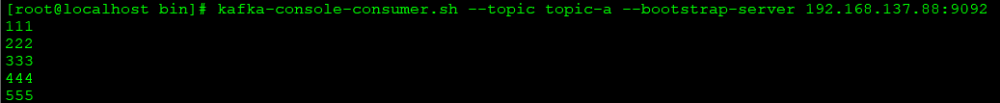
### 2.指定起点消费
从头开始消费
```
kafka-console-consumer.sh --bootstrap-server 192.168.137.88:9092 --topic topic-b --from-beginning 
```
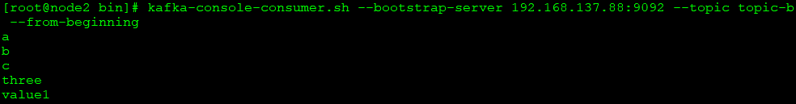   
从指定位移消费
```
kafka-console-consumer.sh --bootstrap-server 192.168.137.88:9092 --topic topic-b --partition 0 --offset 2
```
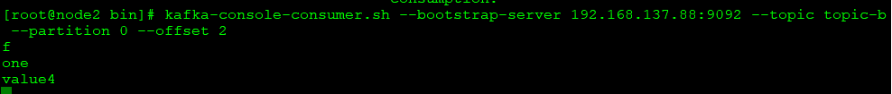   
注：必须指定分区，否则offset无法确定是哪个分区，同时，offset可以指定为earliest、latest或无符号数

### 3.指定partition消费
```
kafka-console-consumer.sh --topic topic-a --partition 0 --bootstrap-server 192.168.137.88:9092
```
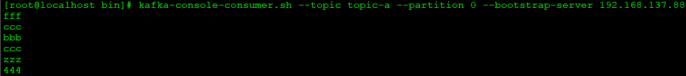

## kafka-consumer-groups.sh
### 1.查看消费组列表
```
kafka-consumer-groups.sh --bootstrap-server 192.168.137.88:9092 --list
```
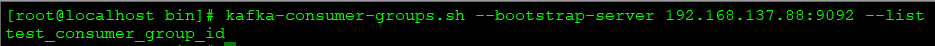

### 2.查看消费组详细
```
kafka-consumer-groups.sh --bootstrap-server 192.168.137.88:9092 --describe --group test_consumer_group_id
```
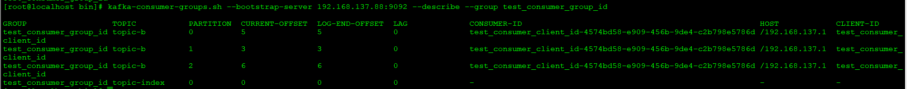
- GROUP：组名
- TOPIC：订阅的主题
- PARTITION：对应的分区编号
- CURRENT-OFFSET：当前偏移量
- LOG-END-OFFSET：HW高水位
- LAG：消费滞后的数量，等于LOG-END-OFFSET - CURRENT-OFFSET
- CONSUMER-ID：消费组成员id
- HOST：消费者所在host
- CLIENT-ID：消费者客户端clientId

### 3.查看消费组状态
```
kafka-consumer-groups.sh --bootstrap-server 192.168.137.88:9092 --describe --group test_consumer_group_id --state
```
- stable：有消费者成员   
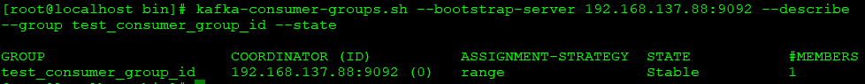
  

- empty：无消费者成员   
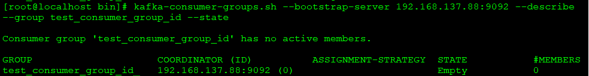   
其他状态：
- prepareingRebalance：准备再平衡
- completeRebalance：完成再平衡
- dead：挂了

### 4.查看消费组成员
```
kafka-consumer-groups.sh --bootstrap-server 192.168.137.88:9092 --describe --group test_consumer_group_id --members --verbose
```
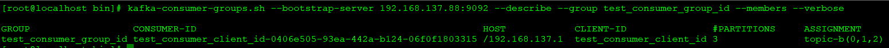

### 5.删除消费组
删除只可处理未在运行的消费组，否则报错
```
kafka-consumer-groups.sh --bootstrap-server 192.168.137.88:9092 --delete --group test_consumer_group_id
```
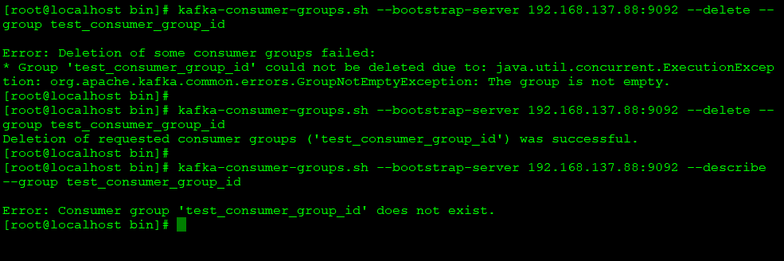

## kafka-producer-perf-test.sh
producer性能测试，可通过自带的脚本kafka-producer-perf-test.sh，主要参数：
- --topic：目标topic
- --num-records：发送消息总数
- --throughput 10：吞吐量，单位时间内成功地传送数据的数量
- --record-size 10：消息大小字节数
- --producer-props：配置本次测试的属性，键值对方式，多个属性用空格，注：是属性，不是命令行的参数 bootstrap.servers=192.168.137.88:9092
```
kafka-producer-perf-test.sh --producer-props bootstrap.servers=192.168.137.88:9092 --topic topic-b --num-records 1000 --throughput 10 --record-size 10
```
执行后可获得传输速率，最大延迟、最小延迟：
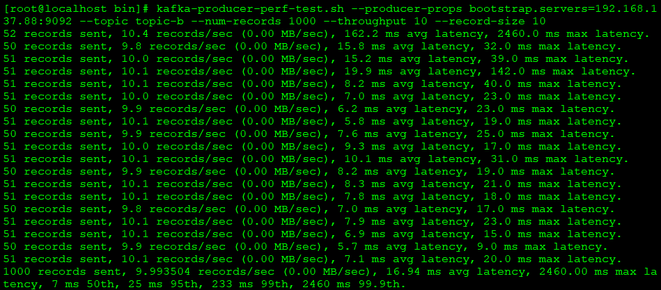
实际发出的测试消息：


## kafka-consumer-perf-test.sh
consumer性能测试，可通过自带脚本kafka-consumer-perf-test.sh，主要参数：
- --bootstrap-server：目标kafka服务节点
- --topic：目标topic
- --messages：消费的消息总数
- --fetch-size：单次请求取回消息的大小，默认1048576B
- --threads：消费消息的线程数
- --timeout：消费超时时间
```
kafka-consumer-perf-test.sh --bootstrap-server 192.168.137.88:9092 --topic topic-b --messages 10000 --fetch-size 100 --threads 1
```
执行后获得消费消息的开始时间、结束时间、记录大小、流量速率（M/S）、记录速率（记录数/S）等信息：
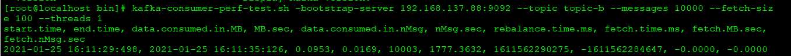
注：测试前要确保主题中的记录数足够，当性能测试拉取的消息总数，大于主题中的消息总数，则会超时，因为迟迟没有拉取到目标数量的消息
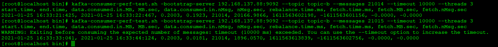
实际测试根据不同的参数修改，测试不同的参数运行情况
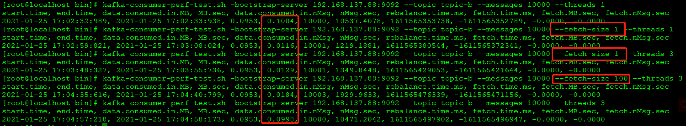

## kafka-delete-records.sh
删除消息脚本，需要通过json文件提供删除的topic 和 partition
```
{
"partitions":
        [
            {
                "topic": "topic-b",
                "partition": 1,
                "offset": 1
            }
        ],
        "version":1
}

```
执行删除脚本
```
 kafka-delete-records.sh --bootstrap-server 192.168.137.88:9092 --offset-json-file delete-records.json
```

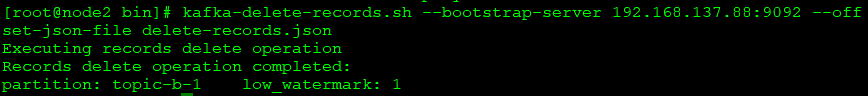    
注：json脚本中的offset是从清除后的low_watermark，即保留到哪个offset，而不是从哪个offset删；如果是1000，执行脚本后，该分区的offset就从1000起，1000之前的消息都删除   
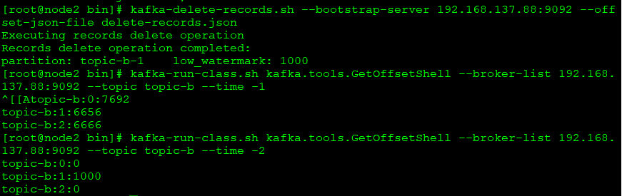

## kafka-dump-log.sh
工具有助于解析日志文件并将其内容转储到控制台，对于调试看似损坏的日志分段或索引分段等信息
- 查看日志输出控制台
```
$KAFKA_HOME/bin/kafka-dump-log.sh --files ./00000000000000000000.log
```
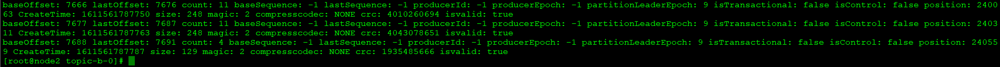
- 查看位移索引数据   
无法直接打开索引文件直观查看索引，通过kafka-dump-log.sh可对偏移量索引的稀疏索引进行查看
```
$ka/bin/kafka-dump-log.sh --files ./00000000000000000000.index
```
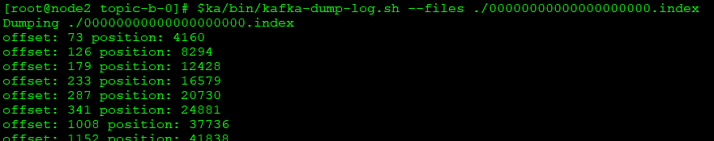

- 查看时间戳索引
```
$ka/bin/kafka-dump-log.sh --files ./00000000000000000000.timeindex
```
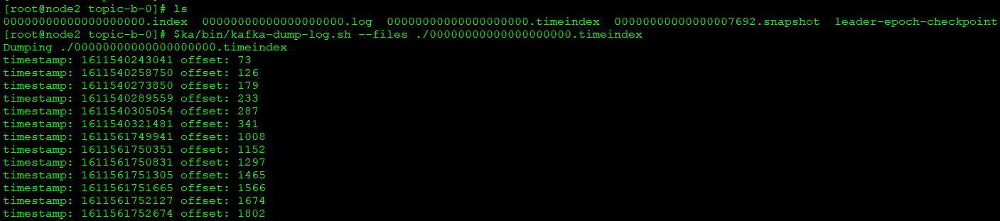

## kafka-log-dirs.sh
通过脚本查看主题中分区日志文件位置、size、offset延迟情况等信息
- --bootstrap-server：必须，目标server
- --describe：必须
- --broker-list：查看目标broker id，不指定则为所有broker
- --topic-list：查询目标topic，不指定则为所有topic
```
kafka-log-dirs.sh --bootstrap-server 192.168.137.88:9092 --broker-list 0 --describe --topic-list topic-b
```
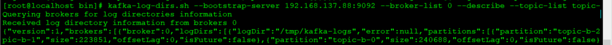
格式化后
```json
{
	"version": 1,
	"brokers": [{
		"broker": 0,
		"logDirs": [{
			"logDir": "/tmp/kafka-logs",
			"error": null,
			"partitions": [{
				"partition": "topic-b-2",
				"size": 221079,
				"offsetLag": 0,
				"isFuture": false
			}, {
				"partition": "topic-b-1",
				"size": 223851,
				"offsetLag": 0,
				"isFuture": false
			}, {
				"partition": "topic-b-0",
				"size": 240688,
				"offsetLag": 0,
				"isFuture": false
			}]
		}]
	}]
}
```
不指定broker，则显式所有节点的分区情况
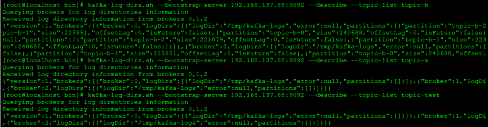
****
## kafka-replica-verification.sh
验证分区内leader副本与非follower副本的同步延迟情况，这个命令有点类似ping命令，就是在规定的频度内不停检查同步延迟情况
- --broker-list：必填，目标server
- --topic-white-list：校验topic列表，不写默认所有topic
- --report-interval-ms：报告的频率，默认30s
```
kafka-replica-verification.sh --broker-list 192.168.137.88:9092
kafka-replica-verification.sh --broker-list 192.168.137.88:9092 --topic-white-list topic-b --report-interval-ms 1000
```
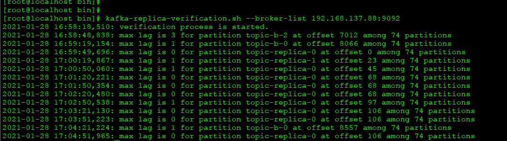    
如图，在有消息生产时，部分分区是在时间点上是有一些同步延迟的记录的，有哪个分区被监控到就打印哪个，所以不用关注为什么打印的是一个分区，其他的怎么没监控，因为监控的是among的后的74个partition

## kafka-verifiable-consumer.sh
消费指定topic的消息，并发出消费者事件，执行的结果以json格式返回
- --bootstrap-server：目标服务器
- --group-id：必选，消费者groupId
- --topic：必选，目标topic
- --max-messages：最大消息数，不选默认-1，不限制
- --reset-policy：消费消息的偏移量起始位置，可选：earliest、latest、none
```
kafka-verifiable-consumer.sh --bootstrap-server 192.168.137.88:9092 --topic topic-b --max-messages 1000 --group-id group
kafka-verifiable-consumer.sh --bootstrap-server 192.168.137.88:9092 --topic topic-b --group-id group
```
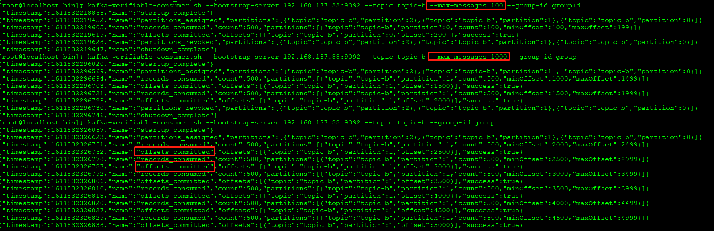
脚本启动后，如果没有max-messages没有设置，则一直守候，主题中有消息即时消费   
返回的消费结果格式
```json
{
	"timestamp": 1611839614834,
	"name": "records_consumed",
	"count": 1,
	"partitions": [{
		"topic": "topic-b",
		"partition": 2,
		"count": 1,
		"minOffset": 8139,
		"maxOffset": 8139
	}]
}
```
同步结果格式
```json
 {
	"timestamp": 1611839614837,
	"name": "offsets_committed",
	"offsets": [{
		"topic": "topic-b",
		"partition": 2,
		"offset": 8140
	}],
	"success": true
}
```
## kafka-verifiable-producer.sh
持续发送消息到指定的topic中，且每条发送的消息都会有响应信息，与kafka-console-producer.sh差别是，console无响应信息，此脚本有响应信息
- --bootstrap-server：目标服务器
- --topic：必选，目标topic
- --max-messages：最大消息数，不选默认-1，不限制
- --acks:消息同步到副本的参数，默认-1所有副本都同步才视为发送成功
```
kafka-verifiable-producer.sh --bootstrap-server 192.168.137.88:9092 --topic topic-b --max-messages 10  --throughput 10
```
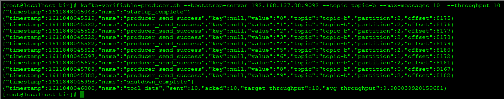
响应格式：
```json
{
	"timestamp": 1611848045882,
	"name": "producer_send_success",
	"key": null,
	"value": "9",
	"topic": "topic-b",
	"partition": 2,
	"offset": 8182
}
```

## kafka-run-class.sh
此脚本开启了一扇面向kafka.tools下所有scala工具的新的大门，通过该脚本可以向java一样在控制台调用kafka.tools下的工具类   
可通过命令先获取工具类的参数说明，在根据其参数使用工具，如：
```
kafka-run-class.sh kafka.tools.GetOffsetShell
```
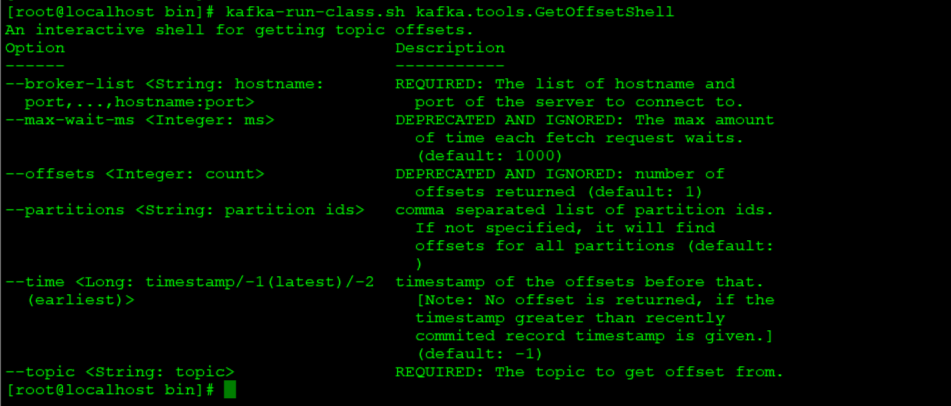    
根据说明使用参数获取topic最大位移
```
kafka-run-class.sh kafka.tools.GetOffsetShell --broker-list 192.168.137.88:9092 --topic topic-b --time -1
```
### 1.获取offset
```
kafka-run-class.sh kafka.tools.GetOffsetShell --broker-list 192.168.137.88:9092 --topic topic-b --time -1
kafka-run-class.sh kafka.tools.GetOffsetShell --broker-list 192.168.137.88:9092 --topic topic-b --time -2
```
- -–time：-1 表示获取最大位移，-2 表示获取当前最早位移；分区当前的消息总数 = –time-1 - –time-2   
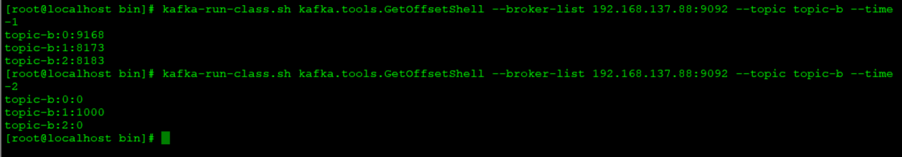

## kafka-mirror-maker.sh
kafka集群复制工具
